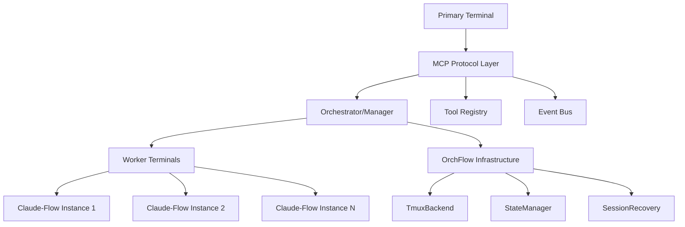

# OrchFlow Terminal Architecture - Technical Implementation Guide

## Overview

This guide provides a comprehensive technical blueprint for implementing OrchFlow's natural language terminal architecture using existing infrastructure. The system consists of three primary components: a Primary Terminal for natural language interaction, an Orchestrator/Manager for task coordination, and Worker Terminals for distributed claude-flow execution.

**Key Design Principle**: Thin wrapper approach - preserve claude-flow's existing coordination mechanisms while adding natural language interface and intelligent orchestration.

**Initialization**: `./claude-flow orchflow` - OrchFlow-branded entry point for natural language terminal experience.

## Table of Contents

1. [System Architecture](#system-architecture)
2. [Implementation Roadmap](#implementation-roadmap)
3. [Technical Specifications](#technical-specifications)
4. [Component Implementation](#component-implementation)
5. [Integration Points](#integration-points)
6. [Performance Optimization](#performance-optimization)
7. [Testing Strategy](#testing-strategy)
8. [Potential Blockers](#potential-blockers)
9. [Code Examples](#code-examples)

## System Architecture

### High-Level Architecture

```
┌─────────────────────────────────────────────────────────────────┐
│                    OrchFlow Terminal Architecture               │
│  ┌─────────────────┐  ┌─────────────────┐  ┌─────────────────┐  │
│  │  Primary        │  │  Orchestrator/  │  │  Worker         │  │
│  │  Terminal       │  │  Manager        │  │  Terminals      │  │
│  │  (70% width)    │  │  (Thin Wrapper) │  │                 │  │
│  │ • Claude-Code   │  │ • Task Graph    │  │ • Multiple      │  │
│  │ • NL Intent     │  │ • Smart Sched   │  │   Claude-Flow   │  │
│  │ • Context Mgmt  │  │ • Worker Spawn  │  │ • Descriptive   │  │
│  │ • Worker Access │  │ • Conflict Det  │  │   Names         │  │
│  │ • Session State │  │ • State Mgmt    │  │ • Progress      │  │
│  └─────────────────┘  └─────────────────┘  └─────────────────┘  │
│           │                     │                     │          │
│           │                     │                     │          │
│  ┌─────────────────────────────────────────────────────────────┐  │
│  │               Status Pane (30% width)                      │  │
│  │  • Live Worker Status   • Descriptive Names               │  │
│  │  • Progress Tracking    • Resource Usage                  │  │
│  │  • Dependency Graph     • Quick Access (1-9)              │  │
│  └─────────────────────────────────────────────────────────────┘  │
│                                                                 │
│  ┌─────────────────────────────────────────────────────────────┐  │
│  │                 MCP Protocol Layer                         │  │
│  │  • Tool Registration  • Event Broadcasting                │  │
│  │  • Message Routing    • Status Aggregation                │  │
│  └─────────────────────────────────────────────────────────────┘  │
│                                                                 │
│  ┌─────────────────────────────────────────────────────────────┐  │
│  │                OrchFlow Infrastructure                      │  │
│  │  • TmuxBackend  • StateManager  • SessionRecovery         │  │
│  │  • WebSocket    • JSON-RPC      • Memory Management       │  │
│  └─────────────────────────────────────────────────────────────┘  │
└─────────────────────────────────────────────────────────────────┘
```

### Component Relationships



## Implementation Roadmap

### Phase 1: Thin Wrapper Foundation (Weeks 1-2)
- **OrchFlow Command**: Implement `./claude-flow orchflow` entry point
- **Split-Screen Layout**: Create 70/30 terminal layout with status pane
- **Basic Orchestrator**: Thin wrapper around claude-flow commands
- **Worker Spawning**: Minimal overhead worker creation with descriptive names
- **Tmux Integration**: Leverage existing TmuxBackend with minimal modifications

### Phase 2: Enhanced User Experience (Weeks 3-4)
- **Natural Language Interface**: Intent recognition for worker management
- **Status Pane**: Real-time worker monitoring with descriptive names
- **Worker Access**: Natural language navigation plus numeric shortcuts (1-9)
- **Passive Monitoring**: Stream-based progress tracking without interruption
- **Context Preservation**: Seamless worker connection and chat capabilities

### Phase 3: Intelligent Orchestration (Weeks 5-6)
- **Smart Scheduling**: Dependency analysis and conflict detection
- **Resource Optimization**: Efficient worker allocation and load balancing
- **Recovery Mechanisms**: Robust worker crash recovery and state restoration
- **Sub-swarm Support**: Hierarchical execution patterns with minimal overhead
- **MCP Integration**: Tool registration for primary terminal orchestration

### Phase 4: Production Readiness (Weeks 7-8)
- **Performance Optimization**: 10+ concurrent workers with minimal overhead
- **Comprehensive Testing**: End-to-end validation of thin wrapper approach
- **User Documentation**: Natural language interface guides and patterns
- **Production Deployment**: OrchFlow-branded terminal architecture rollout

## Technical Specifications

### OrchFlow Command Interface

```typescript
interface OrchFlowCommand {
  command: 'orchflow';
  subcommand?: 'start' | 'status' | 'connect' | 'list';
  args?: Record<string, any>;
}

// Primary entry point: ./claude-flow orchflow
interface OrchFlowEntryPoint {
  initialize(): Promise<void>;
  createSplitLayout(): Promise<LayoutResult>;
  startOrchestrator(): Promise<void>;
  enableNaturalLanguageInterface(): Promise<void>;
}
```

### Status Pane Interface

```typescript
interface StatusPane {
  initialize(): Promise<void>;
  updateWorkerStatus(workerId: string, status: WorkerStatus): void;
  displayWorkerList(workers: WorkerInfo[]): void;
  showDependencyGraph(graph: TaskGraph): void;
  renderResourceUsage(usage: ResourceUsage): void;
  setQuickAccessKeys(workers: WorkerInfo[]): void;
}

interface StatusPaneLayout {
  width: number; // 30% of terminal width
  sections: {
    workers: WorkerDisplaySection;
    resources: ResourceDisplaySection;
    dependencies: DependencyDisplaySection;
    shortcuts: ShortcutDisplaySection;
  };
}
```

### MCP Protocol Interface

```typescript
interface MCPToolRegistry {
  registerTool(name: string, handler: MCPToolHandler): void;
  unregisterTool(name: string): void;
  invokeTool(name: string, params: any): Promise<any>;
  listTools(): MCPToolInfo[];
}

interface MCPToolHandler {
  name: string;
  description: string;
  parameters: JSONSchema;
  handler: (params: any) => Promise<any>;
}

interface MCPMessage {
  id: string;
  type: 'request' | 'response' | 'notification';
  method?: string;
  params?: any;
  result?: any;
  error?: MCPError;
}
```

### Natural Language Intent Recognition

```typescript
interface NLIntentRecognizer {
  parseIntent(input: string, context: ConversationContext): Promise<Intent>;
  registerIntentHandler(pattern: string, handler: IntentHandler): void;
  updateContext(context: ConversationContext): void;
}

interface Intent {
  action: string;
  parameters: Record<string, any>;
  confidence: number;
  context: ConversationContext;
  workerTarget?: string; // For worker-specific actions
}

interface ConversationContext {
  sessionId: string;
  history: Message[];
  activeWorkers: WorkerInfo[];
  currentTask?: Task;
  userPreferences: UserPreferences;
  statusPaneVisible: boolean;
  quickAccessEnabled: boolean;
}
```

### Worker Naming and Access

```typescript
interface WorkerNamer {
  generateName(task: Task): string;
  generateFromDescription(description: string): string;
  ensureUniqueness(name: string, existingNames: string[]): string;
}

interface WorkerAccessManager {
  connectToWorker(workerId: string): Promise<WorkerConnection>;
  connectToWorkerByName(name: string): Promise<WorkerConnection>;
  connectToWorkerByNumber(number: number): Promise<WorkerConnection>;
  listAvailableWorkers(): Promise<WorkerInfo[]>;
  enableQuickAccess(workers: WorkerInfo[]): void;
}

interface WorkerConnection {
  workerId: string;
  descriptiveName: string;
  tmuxPaneId: string;
  isInteractive: boolean;
  connect(): Promise<void>;
  disconnect(): Promise<void>;
  sendMessage(message: string): Promise<void>;
  getHistory(): Promise<string[]>;
}
```

### Task Dependency Graph

```typescript
interface TaskGraph {
  addTask(task: Task): void;
  addDependency(taskId: string, dependsOn: string): void;
  getExecutableTask(): Task[];
  markCompleted(taskId: string): void;
  getStatus(): TaskGraphStatus;
  detectConflicts(newTask: Task): Promise<ConflictInfo[]>;
}

interface Task {
  id: string;
  type: 'research' | 'code' | 'test' | 'analysis' | 'swarm' | 'hive-mind';
  description: string;
  parameters: any;
  dependencies: string[];
  status: 'pending' | 'running' | 'completed' | 'failed';
  assignedWorker?: string;
  assignedWorkerName?: string; // Descriptive name for status pane
  priority: number;
  estimatedDuration?: number;
  claudeFlowCommand?: string; // Generated command for thin wrapper
}

interface ConflictInfo {
  type: 'resource' | 'dependency' | 'file' | 'port';
  conflictingTask: string;
  description: string;
  severity: 'warning' | 'error';
}
```

### Thin Wrapper Integration

```typescript
interface ClaudeFlowWrapper {
  buildCommand(task: Task): string;
  validateCommand(command: string): boolean;
  executeCommand(command: string, options: ExecutionOptions): Promise<ProcessResult>;
  monitorExecution(processId: string): Promise<ExecutionMonitor>;
}

interface ExecutionOptions {
  tmuxPaneId: string;
  descriptiveName: string;
  environment: Record<string, string>;
  workingDirectory: string;
  logOutput: boolean;
}

interface ExecutionMonitor {
  onOutput(callback: (output: string) => void): void;
  onError(callback: (error: string) => void): void;
  onComplete(callback: (result: ProcessResult) => void): void;
  getProgress(): Promise<number>;
  pause(): Promise<void>;
  resume(): Promise<void>;
  terminate(): Promise<void>;
}
```

### Worker Management API

```typescript
interface WorkerManager {
  spawnWorker(type: WorkerType, config: WorkerConfig): Promise<WorkerId>;
  pauseWorker(workerId: WorkerId): Promise<void>;
  resumeWorker(workerId: WorkerId): Promise<void>;
  killWorker(workerId: WorkerId): Promise<void>;
  getWorkerStatus(workerId: WorkerId): Promise<WorkerStatus>;
  listWorkers(): Promise<WorkerInfo[]>;
  assignTask(workerId: WorkerId, task: Task): Promise<void>;
  generateDescriptiveName(task: Task): string;
  connectToWorker(workerId: WorkerId): Promise<WorkerConnection>;
}

interface WorkerConfig {
  type: 'researcher' | 'coder' | 'analyst' | 'tester';
  capabilities: string[];
  resources: ResourceLimits;
  environment: Record<string, string>;
  descriptiveName?: string; // e.g., "JWT Auth Builder", "API Test Runner"
  quickAccessKey?: number; // 1-9 for keyboard shortcuts
}

interface WorkerStatus {
  id: WorkerId;
  descriptiveName: string; // Context-aware name for instant recognition
  status: 'spawning' | 'running' | 'paused' | 'completed' | 'failed';
  currentTask?: Task;
  progress: number;
  resources: ResourceUsage;
  lastHeartbeat: Date;
  tmuxPaneId: string; // For seamless access
  quickAccessKey?: number; // Numeric shortcut for fast navigation
}

interface WorkerConnection {
  sendMessage(message: string): Promise<void>;
  startInteractiveSession(): Promise<void>;
  getOutputHistory(): Promise<string[]>;
  disconnect(): Promise<void>;
}
```

## Component Implementation

### 1. Primary Terminal Implementation

**File Location**: `src/primary-terminal/`

```typescript
// src/primary-terminal/orchflow-terminal.ts
export class OrchFlowTerminal {
  private mcpClient: MCPClient;
  private intentRecognizer: NLIntentRecognizer;
  private conversationContext: ConversationContext;
  private orchestratorClient: OrchestratorClient;
  private statusPane: StatusPane;
  private workerAccessManager: WorkerAccessManager;

  constructor(config: OrchFlowTerminalConfig) {
    this.mcpClient = new MCPClient(config.mcpEndpoint);
    this.intentRecognizer = new NLIntentRecognizer();
    this.conversationContext = new ConversationContext();
    this.orchestratorClient = new OrchestratorClient(config.orchestratorEndpoint);
    this.statusPane = new StatusPane(config.statusPaneConfig);
    this.workerAccessManager = new WorkerAccessManager();
  }

  async initialize(): Promise<void> {
    await this.setupSplitScreenLayout(); // 70/30 split
    await this.mcpClient.connect();
    await this.orchestratorClient.connect();
    await this.statusPane.initialize();
    await this.setupIntentHandlers();
    await this.setupWorkerAccessShortcuts();
    await this.restoreSession();
  }

  private async setupSplitScreenLayout(): Promise<void> {
    // Create 70/30 split screen layout
    const tmuxBackend = new TmuxBackend();
    const session = await tmuxBackend.createSession('orchflow-terminal');
    
    // Split for status pane (30% width)
    const statusPaneId = await tmuxBackend.splitPane(
      session.id,
      session.panes[0].id,
      SplitType.Vertical,
      30 // 30% for status pane
    );
    
    this.statusPane.setPaneId(statusPaneId.id);
  }

  private async setupWorkerAccessShortcuts(): Promise<void> {
    // Setup 1-9 numeric shortcuts for worker access
    for (let i = 1; i <= 9; i++) {
      this.registerShortcut(i.toString(), async () => {
        await this.connectToWorkerByNumber(i);
      });
    }
  }

  private async connectToWorkerByNumber(number: number): Promise<void> {
    const workers = await this.orchestratorClient.listWorkers();
    const targetWorker = workers.find(w => w.quickAccessKey === number);
    
    if (targetWorker) {
      await this.workerAccessManager.connectToWorker(targetWorker.id);
      await this.updateUI(`Connected to ${targetWorker.descriptiveName}`);
    }
  }

  async initialize(): Promise<void> {
    await this.mcpClient.connect();
    await this.orchestratorClient.connect();
    await this.setupIntentHandlers();
    await this.restoreSession();
  }

  async processUserInput(input: string): Promise<void> {
    // Add to conversation history
    this.conversationContext.addMessage({
      type: 'user',
      content: input,
      timestamp: new Date()
    });

    // Parse natural language intent
    const intent = await this.intentRecognizer.parseIntent(
      input, 
      this.conversationContext
    );

    // Handle based on intent
    switch (intent.action) {
      case 'create_task':
        await this.handleCreateTask(intent);
        break;
      case 'check_status':
        await this.handleCheckStatus(intent);
        break;
      case 'pause_worker':
        await this.handlePauseWorker(intent);
        break;
      default:
        await this.handleGenericQuery(intent);
    }
  }

  private async handleCreateTask(intent: Intent): Promise<void> {
    const task: Task = {
      id: generateId(),
      type: intent.parameters.taskType,
      description: intent.parameters.description,
      parameters: intent.parameters,
      dependencies: [],
      status: 'pending',
      priority: intent.parameters.priority || 5
    };

    await this.orchestratorClient.submitTask(task);
    await this.updateUI(`Task created: ${task.description}`);
  }

  private async setupIntentHandlers(): Promise<void> {
    // Register OrchFlow-specific intent patterns
    this.intentRecognizer.registerIntentHandler(
      'create.*task|build.*feature|implement.*',
      this.createTaskHandler.bind(this)
    );

    // Worker access patterns
    this.intentRecognizer.registerIntentHandler(
      'connect.*to.*worker|talk.*to.*worker|inspect.*worker',
      this.connectToWorkerHandler.bind(this)
    );

    this.intentRecognizer.registerIntentHandler(
      'show.*worker.*list|list.*workers|who.*working',
      this.listWorkersHandler.bind(this)
    );

    // Status is now handled by dedicated status pane - no need for explicit requests
    this.intentRecognizer.registerIntentHandler(
      'pause|stop|halt.*worker',
      this.pauseWorkerHandler.bind(this)
    );
    
    // Navigation patterns
    this.intentRecognizer.registerIntentHandler(
      'switch.*to.*worker|go.*to.*worker',
      this.switchToWorkerHandler.bind(this)
    );
  }

  private async connectToWorkerHandler(intent: Intent): Promise<void> {
    const workerName = intent.parameters.workerName;
    const workers = await this.orchestratorClient.listWorkers();
    
    // Find worker by descriptive name
    const targetWorker = workers.find(w => 
      w.descriptiveName.toLowerCase().includes(workerName.toLowerCase())
    );
    
    if (targetWorker) {
      await this.workerAccessManager.connectToWorker(targetWorker.id);
      await this.updateUI(`Connected to ${targetWorker.descriptiveName}`);
    } else {
      await this.updateUI(`Worker '${workerName}' not found. Available workers: ${workers.map(w => w.descriptiveName).join(', ')}`);
    }
  }
}
```

### 2. Orchestrator/Manager Implementation

**File Location**: `src/orchestrator/`

```typescript
// src/orchestrator/orchflow-orchestrator.ts
export class OrchFlowOrchestrator {
  private taskGraph: TaskGraph;
  private workerManager: WorkerManager;
  private mcpServer: MCPServer;
  private stateManager: StateManager;
  private scheduler: SmartScheduler;
  private claudeFlowWrapper: ClaudeFlowWrapper; // Thin wrapper around claude-flow
  private conflictDetector: ConflictDetector;
  private workerNamer: WorkerNamer;

  constructor(config: OrchFlowOrchestratorConfig) {
    this.taskGraph = new TaskGraph();
    this.workerManager = new WorkerManager(config.workerConfig);
    this.mcpServer = new MCPServer(config.mcpPort);
    this.stateManager = new StateManager(config.stateConfig);
    this.scheduler = new SmartScheduler();
    this.claudeFlowWrapper = new ClaudeFlowWrapper();
    this.conflictDetector = new ConflictDetector();
    this.workerNamer = new WorkerNamer();
  }

  async initialize(): Promise<void> {
    await this.mcpServer.start();
    await this.stateManager.initialize();
    await this.registerOrchFlowMCPTools();
    await this.startSmartScheduler();
  }

  async spawnWorkerWithDescriptiveName(task: Task): Promise<WorkerId> {
    // Generate context-aware descriptive name
    const descriptiveName = this.workerNamer.generateName(task);
    
    // Check for conflicts before spawning
    const conflicts = await this.conflictDetector.checkConflicts(task);
    if (conflicts.length > 0) {
      throw new ConflictError(`Task conflicts with: ${conflicts.join(', ')}`);
    }
    
    // Spawn worker using thin wrapper around claude-flow
    const command = this.claudeFlowWrapper.buildCommand(task);
    const workerId = await this.workerManager.spawnWorker(task.type, {
      ...task.config,
      descriptiveName,
      command
    });
    
    return workerId;
  }

  async initialize(): Promise<void> {
    await this.mcpServer.start();
    await this.stateManager.initialize();
    await this.registerMCPTools();
    await this.startScheduler();
  }

  async submitTask(task: Task): Promise<void> {
    this.taskGraph.addTask(task);
    await this.stateManager.persistTask(task);
    await this.scheduler.schedule();
  }

  private async registerOrchFlowMCPTools(): Promise<void> {
    // Register OrchFlow orchestrator tools for Primary Terminal
    this.mcpServer.registerTool('orchflow_submit_task', {
      name: 'orchflow_submit_task',
      description: 'Submit a new task for OrchFlow execution',
      parameters: {
        type: 'object',
        properties: {
          type: { type: 'string' },
          description: { type: 'string' },
          priority: { type: 'number' },
          generateDescriptiveName: { type: 'boolean', default: true }
        }
      },
      handler: this.submitTask.bind(this)
    });

    this.mcpServer.registerTool('orchflow_list_workers', {
      name: 'orchflow_list_workers',
      description: 'List all active workers with descriptive names',
      parameters: {},
      handler: this.listWorkersWithNames.bind(this)
    });

    this.mcpServer.registerTool('orchflow_connect_worker', {
      name: 'orchflow_connect_worker',
      description: 'Connect to a specific worker for interaction',
      parameters: {
        type: 'object',
        properties: {
          workerId: { type: 'string' },
          workerName: { type: 'string' }
        }
      },
      handler: this.connectToWorker.bind(this)
    });

    this.mcpServer.registerTool('orchflow_pause_worker', {
      name: 'orchflow_pause_worker',
      description: 'Pause a specific worker by ID or name',
      parameters: {
        type: 'object',
        properties: {
          workerId: { type: 'string' },
          workerName: { type: 'string' }
        }
      },
      handler: this.pauseWorker.bind(this)
    });

    // Status is now handled by dedicated status pane - no explicit get_status tool needed
  }

  private async startScheduler(): Promise<void> {
    setInterval(async () => {
      const executableTasks = this.taskGraph.getExecutableTask();
      for (const task of executableTasks) {
        await this.executeTask(task);
      }
    }, 1000); // Check every second
  }

  private async executeTask(task: Task): Promise<void> {
    // Find best worker for task
    const workerId = await this.findBestWorker(task);
    
    if (!workerId) {
      // Spawn new worker if none available
      const workerConfig: WorkerConfig = {
        type: task.type as any,
        capabilities: this.getRequiredCapabilities(task),
        resources: this.getResourceLimits(task),
        environment: {}
      };
      
      const newWorkerId = await this.workerManager.spawnWorker(
        task.type as any,
        workerConfig
      );
      
      await this.assignTaskToWorker(newWorkerId, task);
    } else {
      await this.assignTaskToWorker(workerId, task);
    }
  }

  private async findBestWorker(task: Task): Promise<WorkerId | null> {
    const workers = await this.workerManager.listWorkers();
    
    // Find idle worker with matching capabilities
    const suitableWorkers = workers.filter(worker => 
      worker.status === 'running' && 
      !worker.currentTask &&
      this.hasRequiredCapabilities(worker, task)
    );

    if (suitableWorkers.length === 0) {
      return null;
    }

    // Return worker with lowest resource usage
    return suitableWorkers.reduce((best, current) => 
      current.resources.cpuUsage < best.resources.cpuUsage ? current : best
    ).id;
  }
}
```

### 3. Worker Terminal Implementation

**File Location**: `src/worker-terminal/`

```typescript
// src/worker-terminal/orchflow-worker.ts
export class OrchFlowWorker {
  private workerId: WorkerId;
  private descriptiveName: string;
  private tmuxPaneId: string;
  private claudeFlowProcess: ChildProcess;
  private mcpClient: MCPClient;
  private progressReporter: ProgressReporter;
  private stateManager: WorkerStateManager;
  private outputMonitor: OutputMonitor;
  private quickAccessKey?: number;

  constructor(config: WorkerConfig) {
    this.workerId = config.id;
    this.descriptiveName = config.descriptiveName || `Worker-${config.id}`;
    this.quickAccessKey = config.quickAccessKey;
    this.mcpClient = new MCPClient(config.mcpEndpoint);
    this.progressReporter = new ProgressReporter(config.orchestratorEndpoint);
    this.stateManager = new WorkerStateManager(config.stateDir);
    this.outputMonitor = new OutputMonitor();
  }

  async initialize(): Promise<void> {
    await this.createTmuxPane();
    await this.setupPaneTitle(); // Set descriptive name as pane title
    await this.startClaudeFlowProcess();
    await this.mcpClient.connect();
    await this.setupPassiveProgressReporting();
  }

  private async setupPaneTitle(): Promise<void> {
    // Set tmux pane title to descriptive name for easy identification
    const tmuxBackend = new TmuxBackend();
    await tmuxBackend.setPaneTitle(this.tmuxPaneId, this.descriptiveName);
  }

  private async setupPassiveProgressReporting(): Promise<void> {
    // Monitor output stream without interrupting claude-flow
    this.outputMonitor.onOutput((output: string) => {
      const progress = this.parseProgressFromOutput(output);
      if (progress) {
        this.progressReporter.reportProgress(this.workerId, progress);
      }
    });
    
    // Report heartbeat every 10 seconds
    setInterval(async () => {
      await this.progressReporter.reportHeartbeat(this.workerId, {
        descriptiveName: this.descriptiveName,
        quickAccessKey: this.quickAccessKey,
        status: this.getCurrentStatus()
      });
    }, 10000);
  }

  async enableInteractiveAccess(): Promise<WorkerConnection> {
    return {
      sendMessage: async (message: string) => {
        await this.sendToClaudeFlow(message);
      },
      startInteractiveSession: async () => {
        await this.attachToTmuxPane();
      },
      getOutputHistory: async () => {
        return this.outputMonitor.getHistory();
      },
      disconnect: async () => {
        await this.detachFromTmuxPane();
      }
    };
  }

  private async attachToTmuxPane(): Promise<void> {
    const tmuxBackend = new TmuxBackend();
    await tmuxBackend.selectPane(this.tmuxPaneId);
    // User can now interact directly with claude-flow in this pane
  }

  async initialize(): Promise<void> {
    await this.createTmuxPane();
    await this.startClaudeFlowProcess();
    await this.mcpClient.connect();
    await this.setupProgressReporting();
  }

  async executeTask(task: Task): Promise<TaskResult> {
    try {
      await this.stateManager.saveCheckpoint('task_started', { task });
      
      const command = this.buildClaudeFlowCommand(task);
      await this.executeCommand(command);
      
      const result = await this.waitForCompletion();
      await this.stateManager.saveCheckpoint('task_completed', { result });
      
      return result;
    } catch (error) {
      await this.stateManager.saveCheckpoint('task_failed', { error });
      throw error;
    }
  }

  async pause(): Promise<void> {
    if (this.claudeFlowProcess) {
      this.claudeFlowProcess.kill('SIGSTOP');
      await this.stateManager.saveCheckpoint('paused', {});
    }
  }

  async resume(): Promise<void> {
    if (this.claudeFlowProcess) {
      this.claudeFlowProcess.kill('SIGCONT');
      await this.stateManager.saveCheckpoint('resumed', {});
    }
  }

  async spawnSubSwarm(swarmConfig: SwarmConfig): Promise<SwarmId> {
    const subSwarmCommand = `claude-flow swarm "${swarmConfig.objective}" --max-agents ${swarmConfig.maxAgents} --strategy ${swarmConfig.strategy}`;
    
    // Create new tmux pane for sub-swarm
    const subPaneId = await this.tmuxBackend.splitPane(
      this.tmuxPaneId,
      'vertical',
      0.5
    );
    
    // Execute sub-swarm command
    await this.tmuxBackend.sendKeys(subPaneId, subSwarmCommand);
    
    // Return sub-swarm ID for tracking
    return generateId();
  }

  private async createTmuxPane(): Promise<void> {
    // Use OrchFlow's TmuxBackend
    const tmuxBackend = new TmuxBackend();
    const session = await tmuxBackend.createSession(`worker-${this.workerId}`);
    this.tmuxPaneId = session.panes[0].id;
  }

  private async startClaudeFlowProcess(): Promise<void> {
    this.claudeFlowProcess = spawn('claude-flow', ['--interactive'], {
      cwd: process.cwd(),
      env: process.env,
      stdio: ['pipe', 'pipe', 'pipe']
    });

    // Setup output monitoring
    this.claudeFlowProcess.stdout.on('data', (data) => {
      this.handleOutput(data.toString());
    });

    this.claudeFlowProcess.stderr.on('data', (data) => {
      this.handleError(data.toString());
    });
  }

  private async setupProgressReporting(): Promise<void> {
    // Report progress every 5 seconds
    setInterval(async () => {
      const progress = await this.calculateProgress();
      await this.progressReporter.reportProgress(this.workerId, progress);
    }, 5000);
  }

  private buildClaudeFlowCommand(task: Task): string {
    // Thin wrapper - preserve claude-flow's existing command structure
    switch (task.type) {
      case 'research':
        return `claude-flow sparc run researcher "${task.description}"`;
      case 'code':
        return `claude-flow sparc run coder "${task.description}"`;
      case 'test':
        return `claude-flow sparc run tester "${task.description}"`;
      case 'analysis':
        return `claude-flow sparc run analyst "${task.description}"`;
      case 'swarm':
        return `claude-flow swarm "${task.description}" --max-agents ${task.maxAgents || 5}`;
      case 'hive-mind':
        return `claude-flow hive-mind "${task.description}" --strategy ${task.strategy || 'balanced'}`;
      default:
        return `claude-flow task "${task.description}"`;
    }
  }
}
```

## Integration Points

### OrchFlow Component Usage

#### 1. TmuxBackend Integration (Optimized for Minimal Overhead)
```rust
// Leverage existing TmuxBackend with minimal modifications
// File: /workspaces/orchflow/orchflow-mux/src/backend/tmux.rs

use orchflow_mux::backend::tmux::TmuxBackend;
use orchflow_mux::backend::MuxBackend;

impl OrchFlowWorkerManager {
    async fn create_split_layout(&mut self) -> Result<OrchFlowLayout, MuxError> {
        let session_name = "orchflow-terminal";
        let session = self.tmux_backend.create_session(session_name).await?;
        
        // Create status pane (30% width)
        let status_pane = self.tmux_backend.split_pane(
            &session.id,
            &session.panes[0].id,
            SplitType::Vertical,
            Some(30) // 30% for status pane
        ).await?;
        
        // Set pane titles for identification
        self.tmux_backend.set_pane_title(&session.panes[0].id, "OrchFlow Terminal").await?;
        self.tmux_backend.set_pane_title(&status_pane.id, "Status & Workers").await?;
        
        Ok(OrchFlowLayout {
            session_id: session.id,
            primary_pane: session.panes[0].id.clone(),
            status_pane: status_pane.id,
            worker_panes: Vec::new(),
        })
    }
    
    async fn spawn_worker_with_descriptive_name(
        &mut self, 
        task: &Task, 
        descriptive_name: &str
    ) -> Result<String, MuxError> {
        // Create dedicated session for worker to avoid interference
        let session_name = format!("worker-{}", descriptive_name.replace(" ", "-"));
        let session = self.tmux_backend.create_session(&session_name).await?;
        
        // Set descriptive title immediately
        self.tmux_backend.set_pane_title(&session.panes[0].id, descriptive_name).await?;
        
        // Execute claude-flow command directly (thin wrapper)
        let command = self.build_claude_flow_command(task);
        self.tmux_backend.send_keys(&session.panes[0].id, &command).await?;
        
        Ok(session.panes[0].id)
    }
    
    fn build_claude_flow_command(&self, task: &Task) -> String {
        // Preserve claude-flow's existing command structure
        match task.task_type.as_str() {
            "research" => format!("claude-flow sparc run researcher '{}'", task.description),
            "code" => format!("claude-flow sparc run coder '{}'", task.description),
            "test" => format!("claude-flow sparc run tester '{}'", task.description),
            "analysis" => format!("claude-flow sparc run analyst '{}'", task.description),
            "swarm" => format!("claude-flow swarm '{}' --max-agents {}", task.description, task.max_agents.unwrap_or(5)),
            "hive-mind" => format!("claude-flow hive-mind '{}' --strategy {}", task.description, task.strategy.as_deref().unwrap_or("balanced")),
            _ => format!("claude-flow task '{}'", task.description),
        }
    }
}
```

#### 2. StateManager Integration
```rust
// Extend existing StateManager for distributed state
// File: /workspaces/orchflow/desktop/src-tauri/src/state_manager/mod.rs

use orchflow_core::state::StateManager;

impl DistributedStateManager {
    async fn persist_task_state(&mut self, task: &Task) -> Result<(), StateError> {
        let state_key = format!("task:{}", task.id);
        let state_value = serde_json::to_string(task)?;
        
        self.state_manager.set_state(&state_key, &state_value).await?;
        Ok(())
    }
    
    async fn get_task_state(&self, task_id: &str) -> Result<Option<Task>, StateError> {
        let state_key = format!("task:{}", task_id);
        
        if let Some(state_value) = self.state_manager.get_state(&state_key).await? {
            let task: Task = serde_json::from_str(&state_value)?;
            Ok(Some(task))
        } else {
            Ok(None)
        }
    }
}
```

#### 3. WebSocket Integration (Status Pane Updates)
```typescript
// Extend existing WebSocket server for real-time status updates
// File: /workspaces/orchflow/desktop/src-tauri/src/websocket_server.rs

import { WebSocketServer } from '../websocket_server';

export class OrchFlowWebSocketServer extends WebSocketServer {
  private mcpServer: MCPServer;
  private statusPaneUpdater: StatusPaneUpdater;
  
  constructor(port: number) {
    super(port);
    this.mcpServer = new MCPServer();
    this.statusPaneUpdater = new StatusPaneUpdater();
  }

  async handleMCPMessage(message: MCPMessage): Promise<void> {
    const result = await this.mcpServer.processMessage(message);
    await this.broadcast({
      type: 'mcp_response',
      id: message.id,
      result
    });
  }
  
  async broadcastWorkerStatusUpdate(workerId: string, status: WorkerStatus): Promise<void> {
    await this.broadcast({
      type: 'worker_status_update',
      workerId,
      descriptiveName: status.descriptiveName,
      status: status.status,
      progress: status.progress,
      quickAccessKey: status.quickAccessKey,
      timestamp: new Date().toISOString()
    });
    
    // Update status pane immediately
    await this.statusPaneUpdater.updateWorkerDisplay(workerId, status);
  }
  
  async broadcastWorkerListUpdate(workers: WorkerInfo[]): Promise<void> {
    await this.broadcast({
      type: 'worker_list_update',
      workers: workers.map(w => ({
        id: w.id,
        descriptiveName: w.descriptiveName,
        status: w.status,
        quickAccessKey: w.quickAccessKey,
        tmuxPaneId: w.tmuxPaneId
      }))
    });
  }
}
```

#### 4. Session Recovery Integration
```rust
// Extend SessionRecoveryManager for worker recovery
// File: /workspaces/orchflow/muxd/src/session/recovery.rs

use orchflow_mux::session::recovery::SessionRecoveryManager;

impl WorkerRecoveryManager {
    async fn recover_worker(&mut self, worker_id: &str) -> Result<(), RecoveryError> {
        let recovery_config = WorkerRecoveryConfig {
            worker_id: worker_id.to_string(),
            max_retries: 3,
            retry_delay: Duration::from_secs(5),
            recovery_commands: vec![
                format!("tmux new-session -d -s worker-{}", worker_id),
                format!("tmux send-keys -t worker-{} 'claude-flow --resume' Enter", worker_id),
            ],
        };
        
        self.recovery_manager.add_recovery_task(recovery_config).await?;
        Ok(())
    }
}
```

## Performance Optimization

### 1. Resource Management

```typescript
// Resource pool for efficient worker management
class WorkerResourcePool {
  private availableWorkers: Map<WorkerType, ClaudeFlowWorker[]> = new Map();
  private warmupQueue: WorkerType[] = [];
  
  async acquireWorker(type: WorkerType): Promise<ClaudeFlowWorker> {
    const available = this.availableWorkers.get(type);
    if (available && available.length > 0) {
      return available.pop()!;
    }
    
    // Create new worker
    const worker = await this.createWorker(type);
    
    // Trigger warmup for next worker
    this.warmupQueue.push(type);
    this.triggerWarmup();
    
    return worker;
  }
  
  releaseWorker(worker: ClaudeFlowWorker): void {
    const available = this.availableWorkers.get(worker.type) || [];
    available.push(worker);
    this.availableWorkers.set(worker.type, available);
  }
}
```

### 2. Load Balancing

```typescript
// Intelligent load balancing for task distribution
class TaskLoadBalancer {
  private workerMetrics: Map<WorkerId, WorkerMetrics> = new Map();
  
  async selectOptimalWorker(task: Task): Promise<WorkerId> {
    const candidates = await this.getEligibleWorkers(task);
    
    if (candidates.length === 0) {
      throw new Error('No eligible workers available');
    }
    
    // Score workers based on multiple factors
    const scores = candidates.map(worker => ({
      worker,
      score: this.calculateWorkerScore(worker, task)
    }));
    
    // Select highest scoring worker
    scores.sort((a, b) => b.score - a.score);
    return scores[0].worker.id;
  }
  
  private calculateWorkerScore(worker: WorkerInfo, task: Task): number {
    const metrics = this.workerMetrics.get(worker.id);
    if (!metrics) return 0;
    
    let score = 100; // Base score
    
    // Factor in resource usage (lower is better)
    score -= metrics.cpuUsage * 0.5;
    score -= metrics.memoryUsage * 0.3;
    
    // Factor in task compatibility
    score += this.calculateCompatibilityScore(worker, task) * 0.2;
    
    // Factor in recent performance
    score += metrics.averageTaskDuration > 0 ? 
      (1000 / metrics.averageTaskDuration) * 0.1 : 0;
    
    return Math.max(0, score);
  }
}
```

### 3. Memory Optimization

```typescript
// Efficient memory management for high concurrency
class MemoryOptimizer {
  private memoryPools: Map<string, ObjectPool> = new Map();
  
  getObjectPool<T>(type: string, factory: () => T): ObjectPool<T> {
    if (!this.memoryPools.has(type)) {
      this.memoryPools.set(type, new ObjectPool(factory, 10));
    }
    return this.memoryPools.get(type) as ObjectPool<T>;
  }
  
  // Periodic cleanup of unused resources
  startMemoryCleanup(): void {
    setInterval(() => {
      this.cleanupUnusedObjects();
      this.compactMemoryPools();
      this.logMemoryUsage();
    }, 30000); // Every 30 seconds
  }
}

class ObjectPool<T> {
  private available: T[] = [];
  private inUse: Set<T> = new Set();
  
  constructor(
    private factory: () => T,
    private maxSize: number = 10
  ) {}
  
  acquire(): T {
    let obj = this.available.pop();
    if (!obj) {
      obj = this.factory();
    }
    this.inUse.add(obj);
    return obj;
  }
  
  release(obj: T): void {
    this.inUse.delete(obj);
    if (this.available.length < this.maxSize) {
      this.available.push(obj);
    }
  }
}
```

## Testing Strategy

### 1. Unit Testing

```typescript
// Test Primary Terminal natural language processing
describe('NaturalLanguageTerminal', () => {
  let terminal: NaturalLanguageTerminal;
  let mockMCPClient: jest.Mocked<MCPClient>;
  
  beforeEach(() => {
    mockMCPClient = {
      connect: jest.fn(),
      invokeTool: jest.fn(),
      disconnect: jest.fn()
    } as any;
    
    terminal = new NaturalLanguageTerminal({
      mcpEndpoint: 'ws://localhost:3000',
      mcpClient: mockMCPClient
    });
  });
  
  test('should parse create task intent', async () => {
    const input = 'Create a new API endpoint for user authentication';
    const intent = await terminal.parseIntent(input);
    
    expect(intent.action).toBe('create_task');
    expect(intent.parameters.taskType).toBe('code');
    expect(intent.parameters.description).toContain('API endpoint');
  });
  
  test('should handle status queries', async () => {
    const input = 'How are my workers doing?';
    const intent = await terminal.parseIntent(input);
    
    expect(intent.action).toBe('check_status');
    expect(intent.parameters.target).toBe('workers');
  });
});
```

### 2. Integration Testing

```typescript
// Test end-to-end workflow
describe('Natural Language Terminal Integration', () => {
  let system: NLTerminalSystem;
  
  beforeEach(async () => {
    system = new NLTerminalSystem();
    await system.initialize();
  });
  
  afterEach(async () => {
    await system.shutdown();
  });
  
  test('should complete full task workflow', async () => {
    // Submit task via natural language
    await system.primaryTerminal.processUserInput(
      'Build a React component for user profile editing'
    );
    
    // Wait for task completion
    await system.waitForTaskCompletion(30000);
    
    // Verify results
    const tasks = await system.orchestrator.getCompletedTasks();
    expect(tasks).toHaveLength(1);
    expect(tasks[0].status).toBe('completed');
  });
  
  test('should handle worker failures gracefully', async () => {
    // Start task
    await system.primaryTerminal.processUserInput('Analyze codebase performance');
    
    // Simulate worker failure
    const workers = await system.orchestrator.getActiveWorkers();
    await system.orchestrator.killWorker(workers[0].id);
    
    // Verify recovery
    await system.waitForWorkerRecovery(10000);
    
    const newWorkers = await system.orchestrator.getActiveWorkers();
    expect(newWorkers).toHaveLength(1);
  });
});
```

### 3. Performance Testing

```typescript
// Test system performance under load
describe('Performance Tests', () => {
  test('should handle 10 concurrent workers', async () => {
    const system = new NLTerminalSystem();
    await system.initialize();
    
    const startTime = Date.now();
    
    // Submit 10 concurrent tasks
    const tasks = Array.from({ length: 10 }, (_, i) => 
      system.primaryTerminal.processUserInput(`Task ${i}: analyze component performance`)
    );
    
    await Promise.all(tasks);
    
    const endTime = Date.now();
    const duration = endTime - startTime;
    
    expect(duration).toBeLessThan(60000); // Should complete within 60 seconds
    
    // Verify all tasks completed
    const completedTasks = await system.orchestrator.getCompletedTasks();
    expect(completedTasks).toHaveLength(10);
  });
  
  test('should maintain memory usage under 500MB', async () => {
    const system = new NLTerminalSystem();
    await system.initialize();
    
    // Submit many tasks
    for (let i = 0; i < 50; i++) {
      await system.primaryTerminal.processUserInput(`Task ${i}: simple analysis`);
    }
    
    // Wait for completion
    await system.waitForAllTasksCompletion();
    
    // Check memory usage
    const memoryUsage = process.memoryUsage();
    expect(memoryUsage.heapUsed / 1024 / 1024).toBeLessThan(500); // < 500MB
  });
});
```

### 4. Stress Testing

```typescript
// Stress test for system limits
describe('Stress Tests', () => {
  test('should handle rapid task submission', async () => {
    const system = new NLTerminalSystem();
    await system.initialize();
    
    const taskCount = 100;
    const batchSize = 10;
    
    for (let i = 0; i < taskCount; i += batchSize) {
      const batch = Array.from({ length: batchSize }, (_, j) => 
        system.primaryTerminal.processUserInput(`Batch ${i + j}: quick task`)
      );
      
      await Promise.all(batch);
      
      // Small delay between batches
      await new Promise(resolve => setTimeout(resolve, 100));
    }
    
    // Verify system stability
    const systemStatus = await system.getSystemStatus();
    expect(systemStatus.healthy).toBe(true);
  });
});
```

## Potential Blockers

### 1. Thin Wrapper Complexity

**Issue**: Balancing thin wrapper approach with feature richness
**Impact**: Medium - Risk of adding unwanted complexity to claude-flow
**Timeline**: Ongoing design consideration
**Mitigation Strategy**:
```typescript
// Implement minimal wrapper with clear boundaries
// File: src/wrapper/claude-flow-wrapper.ts

export class ClaudeFlowWrapper {
  private preserveOriginalBehavior = true;
  
  async executeCommand(command: string): Promise<void> {
    // Direct passthrough to claude-flow - no modification
    const process = spawn('claude-flow', command.split(' '));
    
    // Only add monitoring, no interference
    this.monitorOutput(process.stdout);
    this.monitorErrors(process.stderr);
    
    // Preserve original exit behavior
    return new Promise((resolve, reject) => {
      process.on('exit', (code) => {
        if (code === 0) resolve();
        else reject(new Error(`claude-flow exited with code ${code}`));
      });
    });
  }
}
```

### 2. Status Pane Performance

**Issue**: Real-time updates may consume resources with many workers
**Impact**: Medium - Performance degradation with 10+ workers
**Timeline**: 1 week for optimization
**Mitigation Strategy**:
```typescript
// Implement efficient update batching
export class StatusPaneOptimizer {
  private updateQueue: Map<string, WorkerStatus> = new Map();
  private batchUpdateInterval = 1000; // 1 second batching
  
  async queueUpdate(workerId: string, status: WorkerStatus): Promise<void> {
    this.updateQueue.set(workerId, status);
    
    // Process queue in batches
    if (this.updateQueue.size >= 5 || this.shouldFlushQueue()) {
      await this.flushUpdateQueue();
    }
  }
  
  private async flushUpdateQueue(): Promise<void> {
    const updates = Array.from(this.updateQueue.entries());
    this.updateQueue.clear();
    
    // Batch render all updates at once
    await this.statusPane.batchUpdateWorkers(updates);
  }
}
```

### 3. Worker Naming Conflicts

**Issue**: Descriptive names may conflict or become confusing
**Impact**: Low - User experience and worker identification
**Timeline**: 1-2 days for conflict resolution
**Mitigation Strategy**:
```typescript
// Implement smart conflict resolution
export class WorkerNameManager {
  private activeNames: Set<string> = new Set();
  private nameHistory: Map<string, number> = new Map();
  
  generateUniqueName(task: Task): string {
    const baseName = this.generateBaseName(task);
    let finalName = baseName;
    let counter = 1;
    
    // Resolve conflicts with numbered suffixes
    while (this.activeNames.has(finalName)) {
      finalName = `${baseName} ${counter}`;
      counter++;
    }
    
    this.activeNames.add(finalName);
    this.nameHistory.set(baseName, counter);
    
    return finalName;
  }
  
  releaseName(name: string): void {
    this.activeNames.delete(name);
  }
  
  private generateBaseName(task: Task): string {
    // Context-aware naming based on task content
    const description = task.description.toLowerCase();
    
    if (description.includes('jwt') || description.includes('auth')) {
      return 'JWT Auth Builder';
    } else if (description.includes('api') && description.includes('test')) {
      return 'API Test Runner';
    } else if (description.includes('database') || description.includes('db')) {
      return 'Database Engineer';
    }
    
    // Fallback to first few words
    const words = task.description.split(' ').slice(0, 2);
    return words.map(w => w.charAt(0).toUpperCase() + w.slice(1)).join(' ') + ' Worker';
  }
}
```

### 4. Natural Language Ambiguity

**Issue**: User input may be ambiguous or unclear
**Impact**: Medium - User experience and accuracy
**Timeline**: 2-3 weeks for robust handling
**Mitigation Strategy**:
```typescript
// Implement clarification and suggestion system
export class IntentClarifier {
  async clarifyIntent(input: string, context: ConversationContext): Promise<Intent> {
    const possibleIntents = await this.getPossibleIntents(input);
    
    if (possibleIntents.length === 1) {
      return possibleIntents[0];
    } else if (possibleIntents.length > 1) {
      // Offer clarification
      const clarification = await this.offerClarification(possibleIntents);
      return clarification;
    } else {
      // Suggest similar actions
      const suggestions = await this.getSuggestions(input, context);
      return {
        action: 'clarify',
        parameters: {
          message: `I'm not sure what you mean. Did you want to:\n${suggestions.join('\n')}`
        }
      };
    }
  }
  
  private async getSuggestions(input: string, context: ConversationContext): Promise<string[]> {
    const suggestions = [];
    
    if (context.activeWorkers.length > 0) {
      suggestions.push('• Connect to an existing worker');
      suggestions.push('• Check worker status');
    }
    
    suggestions.push('• Create a new task');
    suggestions.push('• List available workers');
    
    return suggestions;
  }
}
```

### 5. Tmux Session Management

**Issue**: Managing multiple tmux sessions and panes efficiently
**Impact**: Medium - System organization and user experience
**Timeline**: 1 week for optimization
**Mitigation Strategy**:
```typescript
// Implement efficient tmux session management
export class TmuxSessionManager {
  private sessions: Map<string, SessionInfo> = new Map();
  private paneRegistry: Map<string, PaneInfo> = new Map();
  
  async createOrchFlowSession(): Promise<OrchFlowSession> {
    const sessionId = 'orchflow-main';
    
    // Create or attach to existing session
    const session = await this.tmuxBackend.createSession(sessionId);
    
    // Setup split layout
    const statusPane = await this.tmuxBackend.splitPane(
      session.id,
      session.panes[0].id,
      SplitType.Vertical,
      30
    );
    
    // Configure pane titles
    await this.tmuxBackend.setPaneTitle(session.panes[0].id, 'OrchFlow Terminal');
    await this.tmuxBackend.setPaneTitle(statusPane.id, 'Status & Workers');
    
    return {
      sessionId: session.id,
      primaryPane: session.panes[0].id,
      statusPane: statusPane.id,
      workerSessions: new Map()
    };
  }
  
  async createWorkerSession(workerId: string, descriptiveName: string): Promise<string> {
    const sessionName = `worker-${workerId}`;
    const session = await this.tmuxBackend.createSession(sessionName);
    
    // Set descriptive title
    await this.tmuxBackend.setPaneTitle(session.panes[0].id, descriptiveName);
    
    this.paneRegistry.set(workerId, {
      paneId: session.panes[0].id,
      sessionId: session.id,
      descriptiveName,
      created: new Date()
    });
    
    return session.panes[0].id;
  }
  
  async cleanupInactiveSessions(): Promise<void> {
    const now = new Date();
    const threshold = 30 * 60 * 1000; // 30 minutes
    
    for (const [workerId, paneInfo] of this.paneRegistry.entries()) {
      if (now.getTime() - paneInfo.created.getTime() > threshold) {
        await this.tmuxBackend.killSession(paneInfo.sessionId);
        this.paneRegistry.delete(workerId);
      }
    }
  }
}
```

## Code Examples

### Complete Implementation Example

```typescript
// src/main.ts - OrchFlow Terminal Entry Point
import { OrchFlowTerminal } from './primary-terminal/orchflow-terminal';
import { OrchFlowOrchestrator } from './orchestrator/orchflow-orchestrator';
import { OrchFlowWorkerManager } from './worker-terminal/orchflow-worker-manager';

// Main entry point for: ./claude-flow orchflow
async function main() {
  console.log('🚀 Initializing OrchFlow Terminal Architecture...');
  
  // Initialize system components with thin wrapper approach
  const orchestrator = new OrchFlowOrchestrator({
    mcpPort: 3000,
    stateConfig: { database: './orchflow-state.db' },
    workerConfig: { maxWorkers: 10 },
    thinWrapperMode: true // Preserve claude-flow coordination
  });
  
  const primaryTerminal = new OrchFlowTerminal({
    mcpEndpoint: 'ws://localhost:3000',
    orchestratorEndpoint: 'ws://localhost:3001',
    statusPaneConfig: {
      width: 30, // 30% of terminal width
      updateInterval: 1000, // 1 second updates
      showQuickAccess: true
    }
  });
  
  // Start system with split-screen layout
  await orchestrator.initialize();
  await primaryTerminal.initialize(); // Creates 70/30 split layout
  
  console.log('✅ OrchFlow Terminal System initialized');
  console.log('💡 Use natural language to interact with your development workflow');
  console.log('🔢 Press 1-9 to quickly access workers');
  console.log('📊 Status pane shows live progress and worker information');
  
  // Handle graceful shutdown
  process.on('SIGTERM', async () => {
    console.log('🛑 Shutting down OrchFlow Terminal...');
    await orchestrator.shutdown();
    await primaryTerminal.shutdown();
    process.exit(0);
  });
}

// Register as claude-flow subcommand
if (process.argv.includes('orchflow')) {
  main().catch(console.error);
}
```

### Natural Language Processing Example

```typescript
// src/nlp/orchflow-intent-recognizer.ts
export class OrchFlowIntentRecognizer {
  private patterns: Map<string, IntentPattern> = new Map();
  private workerNamer: WorkerNamer;
  
  constructor() {
    this.initializeOrchFlowPatterns();
    this.workerNamer = new WorkerNamer();
  }
  
  private initializeOrchFlowPatterns(): void {
    // Task creation patterns with descriptive naming
    this.patterns.set('create_task', {
      patterns: [
        /create.*task.*for.*(.+)/i,
        /build.*(.+)/i,
        /implement.*(.+)/i,
        /develop.*(.+)/i,
        /start.*working.*on.*(.+)/i
      ],
      extractor: (match) => {
        const description = match[1];
        const taskType = this.inferTaskType(description);
        const descriptiveName = this.workerNamer.generateFromDescription(description);
        
        return {
          action: 'create_task',
          parameters: {
            description,
            taskType,
            descriptiveName
          }
        };
      }
    });
    
    // Worker access patterns
    this.patterns.set('connect_to_worker', {
      patterns: [
        /connect.*to.*worker.*(.+)/i,
        /talk.*to.*(.+)/i,
        /switch.*to.*(.+)/i,
        /inspect.*worker.*(.+)/i,
        /check.*on.*(.+)/i
      ],
      extractor: (match) => ({
        action: 'connect_to_worker',
        parameters: {
          workerName: match[1].trim()
        }
      })
    });
    
    // Status is handled by dedicated pane - no explicit status requests needed
    // Worker list patterns
    this.patterns.set('list_workers', {
      patterns: [
        /list.*workers?/i,
        /show.*workers?/i,
        /who.*working/i,
        /what.*workers.*active/i
      ],
      extractor: (match) => ({
        action: 'list_workers',
        parameters: {}
      })
    });
    
    // Quick access patterns
    this.patterns.set('quick_access', {
      patterns: [
        /worker.*([1-9])/i,
        /number.*([1-9])/i,
        /([1-9])/i // Just typing a number
      ],
      extractor: (match) => ({
        action: 'quick_access',
        parameters: {
          workerNumber: parseInt(match[1])
        }
      })
    });
  }
  
  private inferTaskType(description: string): TaskType {
    const keywords = {
      'research': ['analyze', 'study', 'investigate', 'research', 'explore'],
      'code': ['build', 'implement', 'create', 'develop', 'code', 'write'],
      'test': ['test', 'verify', 'validate', 'check', 'qa'],
      'analysis': ['analyze', 'examine', 'review', 'assess', 'audit'],
      'swarm': ['swarm', 'team', 'collaborative', 'distributed'],
      'hive-mind': ['hive-mind', 'collective', 'intelligence', 'coordination']
    };
    
    for (const [type, words] of Object.entries(keywords)) {
      if (words.some(word => description.toLowerCase().includes(word))) {
        return type as TaskType;
      }
    }
    
    return 'code'; // Default fallback
  }
}

// Worker naming utility
export class WorkerNamer {
  generateFromDescription(description: string): string {
    // Generate context-aware descriptive names
    const desc = description.toLowerCase();
    
    if (desc.includes('auth') || desc.includes('login')) {
      return 'Auth System Builder';
    } else if (desc.includes('api') || desc.includes('endpoint')) {
      return 'API Developer';
    } else if (desc.includes('test') || desc.includes('testing')) {
      return 'Test Engineer';
    } else if (desc.includes('database') || desc.includes('db')) {
      return 'Database Architect';
    } else if (desc.includes('ui') || desc.includes('interface')) {
      return 'UI Developer';
    } else if (desc.includes('performance') || desc.includes('optimize')) {
      return 'Performance Engineer';
    } else if (desc.includes('security') || desc.includes('secure')) {
      return 'Security Analyst';
    } else {
      // Generate from first few words
      const words = description.split(' ').slice(0, 3);
      return words.map(w => w.charAt(0).toUpperCase() + w.slice(1)).join(' ') + ' Worker';
    }
  }
  
  generateName(task: Task): string {
    return this.generateFromDescription(task.description);
  }
  
  ensureUniqueness(name: string, existingNames: string[]): string {
    let counter = 1;
    let uniqueName = name;
    
    while (existingNames.includes(uniqueName)) {
      uniqueName = `${name} ${counter}`;
      counter++;
    }
    
    return uniqueName;
  }
}
  
  async parseIntent(input: string, context: ConversationContext): Promise<Intent> {
    // Enhanced context-aware parsing
    const contextualInput = this.addContextualClues(input, context);
    
    for (const [action, pattern] of this.patterns) {
      for (const regex of pattern.patterns) {
        const match = contextualInput.match(regex);
        if (match) {
          const baseIntent = pattern.extractor(match);
          return this.enrichWithContext(baseIntent, context);
        }
      }
    }
    
    // Fallback to conversation-based classification
    return this.classifyWithConversationContext(input, context);
  }
  
  private inferTaskType(description: string): TaskType {
    const keywords = {
      'research': ['analyze', 'study', 'investigate', 'research'],
      'code': ['build', 'implement', 'create', 'develop', 'code'],
      'test': ['test', 'verify', 'validate', 'check'],
      'analysis': ['analyze', 'examine', 'review', 'assess']
    };
    
    for (const [type, words] of Object.entries(keywords)) {
      if (words.some(word => description.toLowerCase().includes(word))) {
        return type as TaskType;
      }
    }
    
    return 'code'; // Default fallback
  }
}
```

## Status Pane Implementation

### Real-time Worker Display

```typescript
// src/status-pane/status-pane.ts
export class StatusPane {
  private paneId: string;
  private tmuxBackend: TmuxBackend;
  private workerDisplays: Map<string, WorkerDisplay> = new Map();
  private updateInterval: number = 1000;
  
  constructor(config: StatusPaneConfig) {
    this.tmuxBackend = new TmuxBackend();
    this.updateInterval = config.updateInterval || 1000;
  }
  
  async initialize(): Promise<void> {
    await this.setupStatusPaneLayout();
    await this.startContinuousUpdates();
  }
  
  private async setupStatusPaneLayout(): Promise<void> {
    // Configure status pane display
    await this.tmuxBackend.sendKeys(this.paneId, 'clear');
    await this.renderHeader();
    await this.renderWorkerSection();
    await this.renderResourceSection();
    await this.renderShortcutSection();
  }
  
  private async renderHeader(): Promise<void> {
    const header = `
╔════════════════════════════════╗
║        OrchFlow Status         ║
╠════════════════════════════════╣
║ Workers & Progress             ║
╚════════════════════════════════╝
`;
    await this.tmuxBackend.sendKeys(this.paneId, header);
  }
  
  async updateWorkerDisplay(workerId: string, status: WorkerStatus): Promise<void> {
    const display = `
[${status.quickAccessKey || ' '}] ${status.descriptiveName}
    Status: ${this.getStatusIcon(status.status)} ${status.status}
    Progress: ${this.renderProgressBar(status.progress)}
    CPU: ${status.resources?.cpuUsage || 0}%
    Memory: ${status.resources?.memoryUsage || 0}MB
`;
    
    this.workerDisplays.set(workerId, { display, lastUpdate: new Date() });
    await this.refreshDisplay();
  }
  
  private getStatusIcon(status: string): string {
    switch (status) {
      case 'running': return '🟢';
      case 'paused': return '🟡';
      case 'completed': return '✅';
      case 'failed': return '❌';
      case 'spawning': return '🔄';
      default: return '⚪';
    }
  }
  
  private renderProgressBar(progress: number): string {
    const width = 20;
    const filled = Math.floor((progress / 100) * width);
    const empty = width - filled;
    return `[${'█'.repeat(filled)}${' '.repeat(empty)}] ${progress}%`;
  }
  
  private async renderShortcutSection(): Promise<void> {
    const shortcuts = `
╔════════════════════════════════╗
║      Quick Access (1-9)        ║
╠════════════════════════════════╣
║ Press number to connect        ║
║ 'list workers' for all         ║
║ 'connect to [name]' for search ║
╚════════════════════════════════╝
`;
    await this.tmuxBackend.sendKeys(this.paneId, shortcuts);
  }
}
```

### Worker Access Management

```typescript
// src/worker-access/worker-access-manager.ts
export class WorkerAccessManager {
  private activeConnections: Map<string, WorkerConnection> = new Map();
  private tmuxBackend: TmuxBackend;
  
  constructor() {
    this.tmuxBackend = new TmuxBackend();
  }
  
  async connectToWorker(workerId: string): Promise<WorkerConnection> {
    const existingConnection = this.activeConnections.get(workerId);
    if (existingConnection) {
      return existingConnection;
    }
    
    const workerInfo = await this.getWorkerInfo(workerId);
    const connection = new WorkerConnection(workerInfo, this.tmuxBackend);
    
    await connection.connect();
    this.activeConnections.set(workerId, connection);
    
    return connection;
  }
  
  async connectToWorkerByName(name: string): Promise<WorkerConnection> {
    const workers = await this.listAvailableWorkers();
    const worker = workers.find(w => 
      w.descriptiveName.toLowerCase().includes(name.toLowerCase())
    );
    
    if (!worker) {
      throw new Error(`Worker '${name}' not found`);
    }
    
    return this.connectToWorker(worker.id);
  }
  
  async connectToWorkerByNumber(number: number): Promise<WorkerConnection> {
    const workers = await this.listAvailableWorkers();
    const worker = workers.find(w => w.quickAccessKey === number);
    
    if (!worker) {
      throw new Error(`No worker assigned to key ${number}`);
    }
    
    return this.connectToWorker(worker.id);
  }
}

export class WorkerConnection {
  private workerId: string;
  private descriptiveName: string;
  private tmuxPaneId: string;
  private tmuxBackend: TmuxBackend;
  private isConnected: boolean = false;
  
  constructor(workerInfo: WorkerInfo, tmuxBackend: TmuxBackend) {
    this.workerId = workerInfo.id;
    this.descriptiveName = workerInfo.descriptiveName;
    this.tmuxPaneId = workerInfo.tmuxPaneId;
    this.tmuxBackend = tmuxBackend;
  }
  
  async connect(): Promise<void> {
    if (this.isConnected) return;
    
    // Switch to worker's tmux pane
    await this.tmuxBackend.selectPane(this.tmuxPaneId);
    
    // Show connection message
    await this.tmuxBackend.sendKeys(this.tmuxPaneId, `\n# Connected to ${this.descriptiveName}\n`);
    
    this.isConnected = true;
  }
  
  async disconnect(): Promise<void> {
    if (!this.isConnected) return;
    
    // Send disconnect message
    await this.tmuxBackend.sendKeys(this.tmuxPaneId, `\n# Disconnected from ${this.descriptiveName}\n`);
    
    this.isConnected = false;
  }
  
  async sendMessage(message: string): Promise<void> {
    if (!this.isConnected) {
      throw new Error('Not connected to worker');
    }
    
    await this.tmuxBackend.sendKeys(this.tmuxPaneId, `${message}\n`);
  }
  
  async getHistory(): Promise<string[]> {
    const output = await this.tmuxBackend.capturePane(this.tmuxPaneId);
    return output.split('\n').filter(line => line.trim());
  }
}
```

## Summary

This comprehensive implementation guide provides a production-ready blueprint for building the OrchFlow Terminal Architecture as a smart NPM wrapper around claude-flow.

### Implementation Summary

**Distribution Strategy**: Smart NPM wrapper package `@orchflow/claude-flow` that:
1. Intercepts `claude-flow orchflow` command
2. Delegates all other commands to real claude-flow
3. Downloads Rust binaries on first use
4. Provides seamless integration

**Key Technical Decisions**:
1. **No Plugin System in claude-flow**: Confirmed through analysis - must use wrapper approach
2. **Binary Distribution**: GitHub releases with platform-specific builds
3. **Command Interception**: Clean pass-through for non-orchflow commands
4. **Component Caching**: Store in `~/.orchflow/components/`
5. **Backwards Compatibility**: All existing claude-flow commands work unchanged

**User Experience Achieved**:
```bash
# One-time global install
npm install -g @orchflow/claude-flow

# Natural language orchestration
claude-flow orchflow

# Regular claude-flow commands work
claude-flow swarm "build feature"
claude-flow sparc run developer "add tests"
```

### Key Design Principles:
1. **Smart Wrapper Approach** - NPM package that intercepts orchflow command
2. **Transparent Delegation** - All non-orchflow commands pass through unchanged
3. **On-Demand Components** - Rust binaries download on first use only
4. **Descriptive Worker Names** - Context-aware names for instant recognition
5. **Dedicated Status Pane** - 70/30 split with live monitoring
6. **Seamless Integration** - Works as if part of claude-flow itself

### Implementation Priorities:
1. **NPM Wrapper Package** - Command interception and routing
2. **Component Management** - Binary download and verification
3. **Terminal Interface** - 70/30 split with status pane
4. **Natural Language** - Intent recognition without keywords
5. **Worker Orchestration** - Descriptive names and quick access
6. **Production Polish** - Cross-platform testing and documentation

The system delivers the requested `npx claude-flow orchflow` experience through a transparent wrapper approach, working within the constraints of claude-flow's architecture while providing powerful natural language orchestration capabilities.