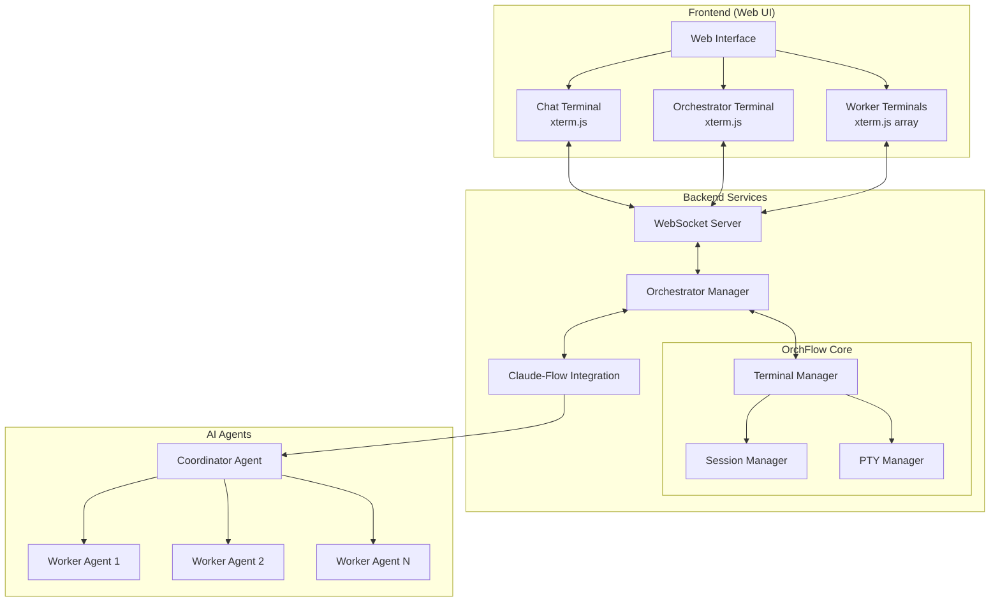

# AI Terminal Orchestrator Demo Architecture

## Overview

This demo showcases an AI-powered terminal orchestration system that combines OrchFlow's terminal management capabilities with claude-flow's swarm intelligence. The system features a three-panel interface where users interact with an AI chat interface that orchestrates work across multiple specialized agent terminals.

## System Architecture

### 1. Three-Panel Layout

```
┌─────────────────────────────────────────────────────────────────┐
│                    AI Terminal Orchestrator                      │
├──────────────────┬──────────────────┬───────────────────────────┤
│                  │                  │                           │
│  Claude-Flow     │   Orchestrator   │    Worker Agents         │
│  Chat Terminal   │    Terminal      │    (Scrollable)          │
│                  │                  │                           │
│  > How can I     │  [Orchestrator]  │  ┌─────────────────┐    │
│    help you?     │  Received task:  │  │ Agent: Coder-01 │    │
│                  │  "Build REST API"│  │ Status: Active  │    │
│  > Build a REST  │                  │  │ Building routes │    │
│    API with user │  Spawning agents:│  └─────────────────┘    │
│    auth          │  - Architect-01  │                           │
│                  │  - Coder-01      │  ┌─────────────────┐    │
│  [Claude-Flow]:  │  - Tester-01     │  │ Agent: Test-01  │    │
│  I'll help you   │                  │  │ Status: Waiting │    │
│  build that...   │  Coordinating... │  │ Pending tasks   │    │
│                  │                  │  └─────────────────┘    │
│                  │                  │                           │
│                  │                  │  ┌─────────────────┐    │
│                  │                  │  │ Agent: Arch-01  │    │
│                  │                  │  │ Status: Active  │    │
│                  │                  │  │ Designing...    │    │
│                  │                  │  └─────────────────┘    │
└──────────────────┴──────────────────┴───────────────────────────┘
```

### 2. Component Architecture



### 3. Communication Flow

1. **User → Chat Terminal**: User types commands in the claude-flow chat terminal
2. **Chat → Orchestrator**: Claude-flow processes the request and sends instructions to the orchestrator
3. **Orchestrator → Workers**: Orchestrator spawns and coordinates worker agents
4. **Workers → Orchestrator**: Workers report progress back to orchestrator
5. **Orchestrator → Chat**: Orchestrator provides status updates to the chat interface

### 4. Technology Stack

#### Frontend
- **Framework**: React/Vue/Svelte (or vanilla JS for simplicity)
- **Terminal Emulation**: xterm.js for all terminal displays
- **WebSocket Client**: For real-time bidirectional communication
- **Layout**: CSS Grid/Flexbox for responsive three-panel layout

#### Backend
- **Server**: Node.js with Express/Fastify
- **WebSocket**: ws or socket.io for real-time communication
- **Terminal Management**: OrchFlow crates via Node.js bindings
- **AI Integration**: claude-flow npm package
- **Process Management**: node-pty for terminal processes

#### OrchFlow Integration
```rust
// Core components used
- orchflow-core: Orchestration engine
- orchflow-mux: Terminal multiplexer abstraction
- orchflow-terminal: PTY management and I/O streaming
```

### 5. Implementation Details

#### Terminal Types

1. **Chat Terminal (Primary)**
   - Runs claude-flow in interactive mode
   - Accepts natural language commands
   - Displays AI responses and status updates
   - No direct development work

2. **Orchestrator Terminal**
   - Receives parsed instructions from chat
   - Manages agent lifecycle
   - Coordinates task distribution
   - Monitors overall progress

3. **Worker Terminals**
   - Named dynamically (e.g., "Architect-01", "Coder-02")
   - Execute specific tasks
   - Report status in real-time
   - Scrollable output with history

#### Message Protocol

```typescript
interface TerminalMessage {
  type: 'command' | 'output' | 'status' | 'spawn' | 'kill';
  terminalId: string;
  payload: any;
}

interface AgentSpawnRequest {
  agentType: 'architect' | 'coder' | 'tester' | 'reviewer';
  agentName: string;
  task: string;
}

interface StatusUpdate {
  agentId: string;
  status: 'idle' | 'working' | 'completed' | 'error';
  progress: number;
  message: string;
}
```

#### WebSocket Events

```javascript
// Client → Server
socket.emit('user-input', { terminalId: 'chat', input: 'Build a REST API' });
socket.emit('spawn-agent', { type: 'coder', task: 'implement auth' });

// Server → Client  
socket.emit('terminal-output', { terminalId: 'orchestrator', data: 'Spawning agents...' });
socket.emit('agent-spawned', { agentId: 'coder-01', terminalId: 'worker-3' });
socket.emit('status-update', { agentId: 'coder-01', status: 'working', progress: 45 });
```

### 6. Key Features

1. **Dynamic Agent Spawning**
   - Orchestrator can spawn agents on demand
   - Each agent gets its own terminal window
   - Automatic naming and task assignment

2. **Real-time Status Updates**
   - Live progress indicators
   - Status badges (idle, working, completed)
   - Output streaming from each terminal

3. **Scrollable Worker Area**
   - Virtual scrolling for many agents
   - Minimize/maximize individual terminals
   - Search and filter capabilities

4. **Inter-terminal Communication**
   - Direct messaging between terminals
   - Shared context via orchestrator
   - Event-driven coordination

### 7. Development Workflow

1. User enters request in chat terminal
2. Claude-flow analyzes and creates execution plan
3. Plan sent to orchestrator terminal
4. Orchestrator spawns required worker agents
5. Workers execute tasks in parallel
6. Progress displayed in real-time
7. Results aggregated and reported back

### 8. Example Session

```
[Chat Terminal]
> Build a user authentication system with JWT

[Claude-Flow]: I'll help you build a JWT authentication system. 
Let me coordinate the necessary agents...

[Orchestrator Terminal]
Received task: Build JWT authentication system
Analyzing requirements...
Spawning agents:
- Architect-01: Design auth architecture
- Coder-01: Implement auth middleware  
- Coder-02: Create user models
- Tester-01: Write auth tests
- Security-01: Security audit

[Worker: Architect-01]
Designing authentication flow...
- JWT token generation
- Refresh token strategy
- Session management
✓ Architecture complete

[Worker: Coder-01]
Implementing auth middleware...
- Creating JWT utilities
- Building middleware functions
Progress: 75%
```

### 9. Scalability Considerations

- Support for 10-20 concurrent worker terminals
- Efficient terminal output buffering
- Virtual scrolling for performance
- WebSocket connection pooling
- Resource cleanup on agent completion

### 10. Future Enhancements

- Terminal recording and playback
- Agent collaboration protocols
- Visual task dependency graphs
- Performance metrics dashboard
- Export session logs
- Template-based agent creation