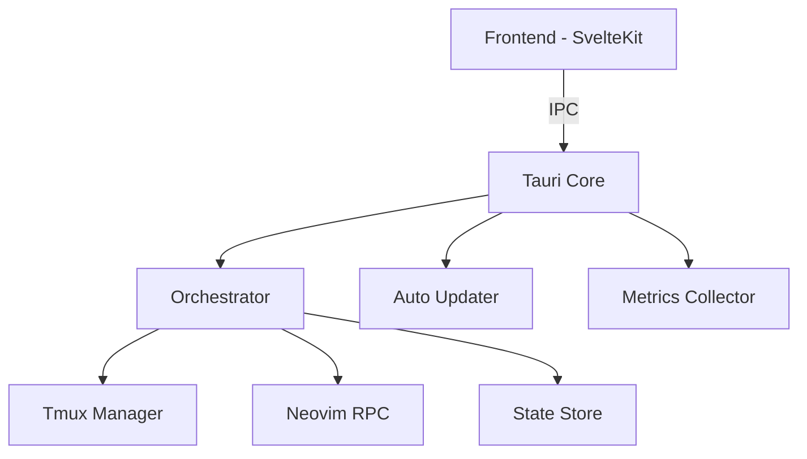

# OrchFlow Frontend

<div align="center">
  
  
  ### 🚀 VS Code-Style Terminal-Orchestrated Developer GUI
  
  [](https://github.com/orchflow/orchflow/releases)
  [](https://github.com/orchflow/orchflow/actions)
  [](LICENSE)
</div>

## Overview

OrchFlow is a modern, high-performance developer environment that combines the power of Neovim with intelligent terminal orchestration in a beautiful VS Code-style GUI. Built with Tauri, SvelteKit, and Rust for native performance across all platforms.

### ✨ Key Features

- **🖥️ Native Desktop App** - Sub-100ms response times with minimal resource usage
- **🎨 VS Code-Style Interface** - Familiar UI with activity bar, file explorer, and command palette
- **🔧 Terminal Orchestration** - Intelligent tmux integration for seamless workflow management
- **⚡ Neovim Integration** - Full Neovim RPC support with native performance
- **🤖 AI Assistant** - Built-in AI helper with streaming diff support
- **📊 Live Metrics** - Real-time system monitoring with 2-second updates
- **🔄 Auto-Updates** - Seamless background updates with signature verification
- **🎯 Keyboard-First** - Comprehensive shortcuts for everything (Ctrl-K for commands)

## Quick Start

### Install from Release

Download the latest installer for your platform:

- **macOS**: [OrchFlow.dmg](https://github.com/orchflow/orchflow/releases/latest) (Intel & Apple Silicon)
- **Windows**: [OrchFlow-setup.exe](https://github.com/orchflow/orchflow/releases/latest)
- **Linux**: [OrchFlow.AppImage](https://github.com/orchflow/orchflow/releases/latest)

### Build from Source

```bash
# Prerequisites
# - Node.js 18+
# - Rust 1.75+
# - Platform-specific build tools (see DEVELOPMENT.md)

# Clone the repository
git clone https://github.com/orchflow/orchflow.git
cd orchflow/desktop

# Install dependencies
npm install

# Development mode with hot-reload
npm run tauri:dev

# Build for production
npm run tauri:build
```

## Keyboard Shortcuts

| Action | Shortcut |
|--------|----------|
| Command Palette | `Ctrl/Cmd + K` |
| Quick Open File | `Ctrl/Cmd + P` |
| Settings | `Ctrl/Cmd + ,` |
| New Terminal | `` Ctrl + ` `` |
| Toggle Sidebar | `Ctrl/Cmd + B` |
| File Explorer | `Ctrl/Cmd + Shift + E` |
| Git Panel | `Ctrl/Cmd + Shift + G` |
| Symbol Outline | `Ctrl/Cmd + Shift + O` |
| Switch Theme | `Ctrl/Cmd + K, D` |

## Project Structure

```
frontend/
├── src/                    # Frontend source code
│   ├── lib/               
│   │   ├── components/    # Svelte components
│   │   ├── services/      # Business logic
│   │   └── stores/        # State management
│   └── routes/            # SvelteKit routes
├── src-tauri/             # Rust backend
│   ├── src/              
│   │   ├── main.rs       # Entry point
│   │   ├── orchestrator.rs # Core orchestration
│   │   ├── tmux.rs       # Terminal management
│   │   ├── neovim.rs     # Editor integration
│   │   └── updater.rs    # Auto-update system
│   └── tauri.conf.json   # Tauri configuration
├── cypress/               # E2E tests
├── scripts/               # Build & utility scripts
└── docs/                  # Documentation
```

## Architecture

OrchFlow follows a modular architecture with clear separation of concerns:



## Development

### Prerequisites

- **Node.js** 18 or later
- **Rust** 1.75 or later
- **Platform Tools**:
  - macOS: Xcode Command Line Tools
  - Windows: Visual Studio Build Tools
  - Linux: `build-essential`, `libwebkit2gtk-4.0-dev`

### Setup Development Environment

```bash
# Install dependencies
npm install

# Generate app icons (requires ImageMagick)
npm run icons:generate

# Generate updater keys (first time only)
npm run updater:keygen

# Start development server
npm run tauri:dev
```

### Running Tests

```bash
# Unit tests
npm run test:unit

# E2E tests
npm run test:e2e

# Performance tests
npm run test:performance

# All tests
npm test
```

### Code Quality

```bash
# Type checking
npm run check

# Linting (if configured)
npm run lint

# Format code
npm run format
```

## Building & Distribution

### Local Build

```bash
# Build for current platform
npm run tauri:build

# Build with debug symbols
npm run tauri:build:debug
```

### Release Process

1. **Update Version**
   ```bash
   npm version patch  # or minor/major
   ```

2. **Create Release**
   ```bash
   git tag v0.1.0
   git push origin v0.1.0
   ```

3. **GitHub Actions** will automatically:
   - Build for all platforms
   - Sign installers
   - Create GitHub release
   - Upload installers
   - Generate update manifests

See [DEPLOYMENT.md](DEPLOYMENT.md) for detailed release instructions.

## Configuration

OrchFlow stores configuration in platform-specific locations:

- **macOS**: `~/Library/Application Support/com.orchflow.app/`
- **Windows**: `%APPDATA%\com.orchflow.app\`
- **Linux**: `~/.config/com.orchflow.app/`

### Settings Structure

```json
{
  "appearance": {
    "theme": "dark",
    "fontSize": 14,
    "fontFamily": "Monaco, monospace"
  },
  "editor": {
    "tabSize": 2,
    "wordWrap": true
  },
  "terminal": {
    "shell": "/bin/zsh",
    "fontSize": 13
  }
}
```

## Troubleshooting

### Common Issues

**App won't start**
- Check logs in: `~/.config/com.orchflow.app/logs/`
- Try running with: `npm run tauri:dev`

**Terminal not working**
- Ensure tmux is installed: `brew install tmux` or `apt install tmux`
- Check terminal permissions in System Preferences (macOS)

**Updates failing**
- Verify internet connection
- Check firewall settings
- Manual download from [releases](https://github.com/orchflow/orchflow/releases)

### Debug Mode

```bash
# Run with debug logging
RUST_LOG=debug npm run tauri:dev

# Check Tauri info
npm run tauri info
```

## Contributing

We welcome contributions! Please see [CONTRIBUTING.md](CONTRIBUTING.md) for guidelines.

### Development Workflow

1. Fork the repository
2. Create feature branch: `git checkout -b feature-name`
3. Make changes and test
4. Commit with clear messages
5. Push and create PR

### Code Standards

- Use TypeScript for type safety
- Follow existing code style
- Add tests for new features
- Update documentation

## Security

- **Code Signing**: All releases are signed
- **Update Security**: Updates use signature verification
- **Reporting**: Email security@orchflow.dev

See [SECURITY.md](SECURITY.md) for details.

## License

OrchFlow is open source under the MIT License. See [LICENSE](LICENSE) for details.

## Acknowledgments

Built with amazing open source projects:
- [Tauri](https://tauri.app/) - Native app framework
- [SvelteKit](https://kit.svelte.dev/) - Frontend framework
- [Neovim](https://neovim.io/) - Editor engine
- [tmux](https://github.com/tmux/tmux) - Terminal multiplexer

## Links

- [Website](https://orchflow.dev)
- [Documentation](https://docs.orchflow.dev)
- [Releases](https://github.com/orchflow/orchflow/releases)
- [Issues](https://github.com/orchflow/orchflow/issues)
- [Discussions](https://github.com/orchflow/orchflow/discussions)