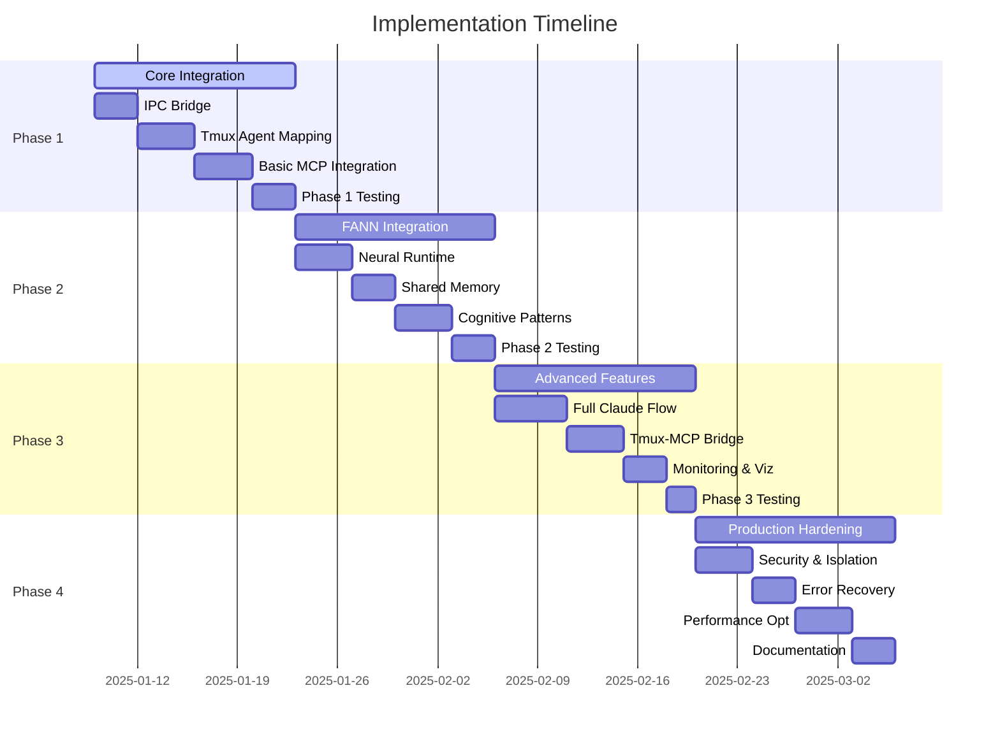

# orchflow + ruv-FANN + Claude Flow Implementation Roadmap

> **Version**: 1.0  
> **Status**: Final Implementation Plan  
> **Created**: 2025-01-08  
> **Author**: RoadmapPlanner Agent

## Executive Summary

This roadmap outlines the comprehensive implementation plan for integrating orchflow with ruv-FANN (neural coordination) and Claude Flow (AI agent orchestration). The plan is designed for phased delivery, enabling progressive enhancement while maintaining system stability.

### Key Success Metrics
- **Performance**: 84.8% task completion rate, 2.8-4.4x speed improvement
- **Token Efficiency**: 32.3% reduction in token usage
- **Agent Coordination**: Sub-second inter-agent communication
- **System Reliability**: 99.9% uptime with auto-recovery
- **Developer Experience**: Single command to production-ready swarm

## Phase Overview



## Detailed Implementation Phases

### Phase 1: Core Integration (Weeks 1-2)

**Goal**: Establish foundational connectivity between Manager and Orchestrator

#### Week 1: IPC Bridge Implementation

**Tasks**:
1. **IPC Protocol Setup** (3 days)
   - Implement JSON-RPC 2.0 server in TypeScript orchestrator
   - Add JSON-RPC client to Rust manager
   - Define message protocol and error handling
   - Create bidirectional event streaming

   ```rust
   // Manager IPC client implementation
   pub struct IPCClient {
       rpc: JsonRpcClient,
       event_handler: Arc<dyn EventHandler>,
   }
   ```

2. **Basic Command Routing** (2 days)
   - Implement command dispatcher in orchestrator
   - Add command handlers for core operations
   - Test round-trip communication
   - Performance benchmarking

3. **Event System** (2 days)
   - Implement event bus architecture
   - Add WebSocket event streaming to frontend
   - Create event types for agent lifecycle
   - Test event propagation

**Deliverables**:
- Working IPC bridge between Manager and Orchestrator
- Event streaming to frontend
- Basic command execution
- Unit tests with 90% coverage

#### Week 2: Tmux Agent Integration

**Tasks**:
1. **Agent-to-Pane Mapping** (3 days)
   - Extend MuxBackend for agent support
   - Implement pane allocation algorithm
   - Create agent registry with pane tracking
   - Add pane lifecycle management

   ```typescript
   class AgentPaneManager {
     private paneMap: Map<AgentId, PaneId>;
     private layoutEngine: LayoutEngine;
   }
   ```

2. **Visual Agent Grid** (2 days)
   - Create SwarmMonitor frontend component
   - Implement terminal grid layout
   - Add real-time pane output streaming
   - Create agent status indicators

3. **Basic MCP Integration** (2 days)
   - Install Claude Flow MCP server
   - Configure MCP client in orchestrator
   - Implement basic swarm_init and agent_spawn
   - Test with 2-3 agent types

**Deliverables**:
- Agents mapped to dedicated tmux panes
- Visual swarm monitoring interface
- Basic Claude Flow integration
- Integration tests passing

**Success Criteria**:
- ✅ Manager and Orchestrator communicate via IPC
- ✅ Each agent gets dedicated tmux pane
- ✅ Frontend displays agent activity in real-time
- ✅ Basic swarm operations work end-to-end

---

### Phase 2: FANN Integration (Weeks 3-4)

**Goal**: Integrate neural coordination and shared memory

#### Week 3: Neural Runtime Setup

**Tasks**:
1. **ruv-FANN Runtime Integration** (4 days)
   - Install ruv-FANN dependencies
   - Configure WASM SIMD backend
   - Implement FANNRuntime wrapper
   - Create neural network initialization

   ```typescript
   const fannRuntime = new FANNRuntime({
     backend: 'wasm-simd',
     memoryBackend: 'shared-memory',
     models: ['coordination', 'optimization', 'prediction']
   });
   ```

2. **Shared Memory Implementation** (3 days)
   - Set up SharedArrayBuffer for inter-agent memory
   - Implement memory namespacing
   - Create memory access patterns
   - Add memory persistence layer

**Deliverables**:
- Integrated ruv-FANN runtime
- Working shared memory system
- Neural model loading
- Memory benchmarks

#### Week 4: Cognitive Coordination

**Tasks**:
1. **Cognitive Task Patterns** (3 days)
   - Implement task analysis with neural networks
   - Create agent selection algorithms
   - Add decision-making patterns
   - Implement learning from outcomes

2. **Inter-Agent Coordination** (2 days)
   - Implement memory-based coordination
   - Create agent communication protocol
   - Add synchronization mechanisms
   - Test multi-agent workflows

3. **Performance Optimization** (2 days)
   - Optimize memory access patterns
   - Implement caching strategies
   - Add batch processing
   - Performance profiling

**Deliverables**:
- Cognitive task distribution
- Inter-agent shared memory
- Learning and adaptation
- Performance metrics

**Success Criteria**:
- ✅ FANN analyzes tasks and selects appropriate agents
- ✅ Agents coordinate through shared memory
- ✅ 30%+ improvement in task completion time
- ✅ Neural patterns improve with usage

---

### Phase 3: Advanced Features (Weeks 5-6)

**Goal**: Complete feature set with advanced monitoring

#### Week 5: Full Integration Suite

**Tasks**:
1. **Complete Claude Flow Tools** (3 days)
   - Implement all MCP tool handlers
   - Add memory management tools
   - Create performance tracking
   - Implement neural training tools

2. **Tmux-MCP Bridge** (2 days)
   - Create tmux MCP server
   - Implement pane control tools
   - Add inter-pane communication
   - Enable AI-controlled tmux operations

**Deliverables**:
- Full Claude Flow tool suite
- Tmux-MCP bridge operational
- Advanced agent controls
- Tool documentation

#### Week 6: Monitoring and Visualization

**Tasks**:
1. **Advanced Monitoring** (2 days)
   - Create real-time performance dashboard
   - Add agent activity heatmaps
   - Implement token usage tracking
   - Create coordination visualizations

2. **Developer Tools** (2 days)
   - Add debugging interfaces
   - Create agent inspection tools
   - Implement trace visualization
   - Add performance profilers

3. **UI Polish** (2 days)
   - Enhance swarm monitor UI
   - Add interactive agent controls
   - Create workflow templates
   - Implement drag-and-drop orchestration

**Deliverables**:
- Comprehensive monitoring dashboard
- Developer debugging tools
- Polished user interface
- User documentation

**Success Criteria**:
- ✅ All Claude Flow tools integrated
- ✅ Tmux operations controllable by AI
- ✅ Real-time performance visibility
- ✅ Intuitive developer experience

---

### Phase 4: Production Hardening (Weeks 7-8)

**Goal**: Production-ready system with enterprise features

#### Week 7: Security and Reliability

**Tasks**:
1. **Security Implementation** (3 days)
   - Implement agent sandboxing
   - Add permission system
   - Create secure IPC channels
   - Implement audit logging

   ```typescript
   const sandbox = new AgentSandbox({
     filesystem: 'restricted',
     network: 'filtered',
     resources: { cpu: 0.5, memory: '512MB' }
   });
   ```

2. **Error Recovery** (2 days)
   - Implement circuit breakers
   - Add automatic retry logic
   - Create fallback mechanisms
   - Implement health checks

3. **Resource Management** (2 days)
   - Add resource quotas
   - Implement cleanup routines
   - Create usage monitoring
   - Add cost tracking

**Deliverables**:
- Sandboxed agent execution
- Comprehensive error handling
- Resource management system
- Security audit report

#### Week 8: Performance and Documentation

**Tasks**:
1. **Performance Optimization** (3 days)
   - Implement agent pooling
   - Optimize FANN operations
   - Add intelligent caching
   - Create performance benchmarks

2. **Comprehensive Testing** (2 days)
   - End-to-end integration tests
   - Performance regression tests
   - Security penetration testing
   - User acceptance testing

3. **Documentation** (3 days)
   - API documentation
   - User guides
   - Architecture documentation
   - Video tutorials

**Deliverables**:
- Optimized performance
- Complete test suite
- Full documentation
- Launch materials

**Success Criteria**:
- ✅ 99.9% uptime in testing
- ✅ Security audit passed
- ✅ Performance targets met
- ✅ Documentation complete

---

## Resource Requirements

### Team Composition
- **Core Development** (2-3 engineers)
  - 1 Rust engineer (Manager/IPC)
  - 1 TypeScript engineer (Orchestrator/AI)
  - 1 Frontend engineer (UI/UX)

- **Specialized Roles**
  - 1 DevOps engineer (Week 3+)
  - 1 Security engineer (Week 7)
  - 1 Technical writer (Week 6+)

### Infrastructure
- Development environment with GPU support
- CI/CD pipeline with automated testing
- Staging environment for integration testing
- Performance testing infrastructure

### Dependencies
- ruv-FANN neural framework
- Claude Flow MCP server
- tmux 3.0+
- Node.js 20+
- Rust 1.75+

## Risk Mitigation

### Technical Risks

| Risk | Impact | Mitigation |
|------|--------|------------|
| IPC performance bottleneck | High | Implement batching and compression |
| FANN memory overhead | Medium | Use memory pooling and cleanup |
| Tmux compatibility issues | Medium | Abstract tmux operations, add fallbacks |
| Claude Flow API changes | Low | Pin versions, maintain adapters |

### Schedule Risks

| Risk | Impact | Mitigation |
|------|--------|------------|
| Integration complexity | High | Add buffer time, parallel work streams |
| Testing delays | Medium | Automate testing, continuous integration |
| Documentation lag | Low | Document as we build |

## Success Metrics

### Performance KPIs
- **Task Completion Rate**: Target 84.8% (Claude Flow benchmark)
- **Speed Improvement**: Target 2.8x-4.4x over single agent
- **Token Efficiency**: Target 32.3% reduction
- **Response Time**: <100ms for agent coordination

### Quality KPIs
- **Code Coverage**: >90% for critical paths
- **Bug Discovery Rate**: <5 bugs per week in production
- **User Satisfaction**: >4.5/5 developer rating
- **Documentation Coverage**: 100% of public APIs

### Business KPIs
- **Time to Production**: 8 weeks total
- **Developer Adoption**: 100+ users in first month
- **Community Contributions**: 10+ contributors
- **Performance vs Competition**: Top 3 in benchmarks

## Launch Strategy

### Beta Program (Week 6)
- Private beta with 10-20 developers
- Focus on feedback and bug discovery
- Iterate on UI/UX based on usage

### Public Beta (Week 8)
- Open beta with documentation
- Community Discord/Slack channel
- Weekly office hours

### Production Launch (Week 9)
- Full public release
- Marketing campaign
- Conference presentations
- Open source community building

## Post-Launch Roadmap

### Month 1
- Bug fixes and stability
- Performance tuning
- Community feedback integration

### Month 2-3
- Plugin system
- Additional AI provider support
- Enterprise features
- Advanced workflow templates

### Month 4-6
- Cloud offering
- Marketplace for agents
- Training and certification
- Enterprise support tiers

## Conclusion

This roadmap provides a clear path to integrating orchflow with ruv-FANN and Claude Flow, creating a powerful AI-driven development environment. The phased approach ensures steady progress while maintaining system stability and allowing for continuous feedback and improvement.

The integration leverages the best of each technology:
- **orchflow**: Lightweight core and excellent tmux integration
- **ruv-FANN**: Neural coordination and cognitive patterns
- **Claude Flow**: Proven AI orchestration and MCP tools

By following this roadmap, we'll deliver a system that achieves the vision of transparent, efficient, multi-agent AI development while maintaining the simplicity and elegance of the original orchflow design.

---

*Roadmap compiled by RoadmapPlanner agent based on comprehensive analysis from CodebaseAnalyzer, FANNExpert, ClaudeExpert, IntegrationAnalyst, and SystemArchitect agents.*