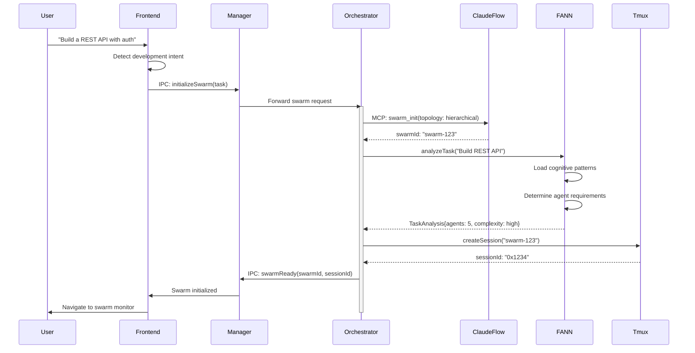
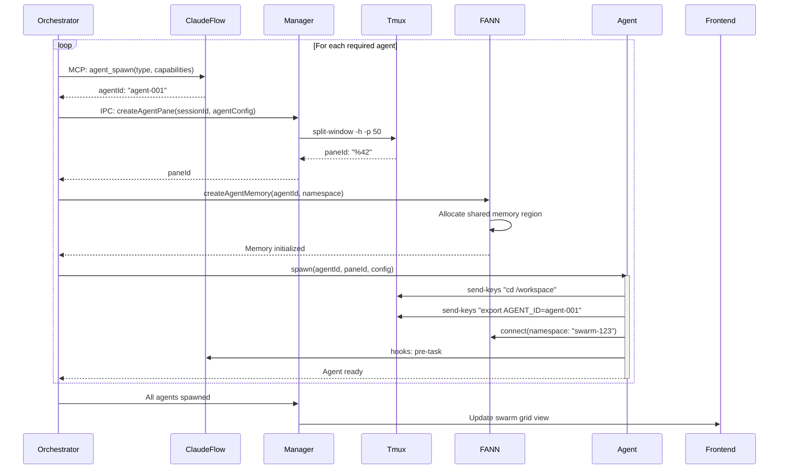
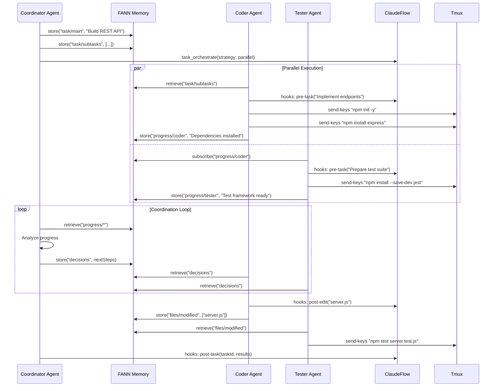

# orchflow Integration Sequence Diagrams

> **Version**: 1.0  
> **Created**: 2025-01-08  
> **Author**: SystemArchitect Agent

## Table of Contents

1. [Swarm Initialization Sequence](#swarm-initialization-sequence)
2. [Agent Spawning and Pane Mapping](#agent-spawning-and-pane-mapping)
3. [Task Execution with Coordination](#task-execution-with-coordination)
4. [Inter-Agent Communication](#inter-agent-communication)
5. [Error Recovery and Resilience](#error-recovery-and-resilience)

## Swarm Initialization Sequence



## Agent Spawning and Pane Mapping



## Task Execution with Coordination



## Inter-Agent Communication

```mermaid
sequenceDiagram
    participant AgentA as Backend Agent
    participant FANN as FANN Memory
    participant TmuxMCP as Tmux-MCP
    participant AgentB as Auth Agent
    participant Monitor as Monitor Agent

    AgentA->>FANN: store("need/help", {
        type: "auth_implementation",
        context: "JWT middleware needed"
    })
    
    FANN->>Monitor: notify("help_request")
    Monitor->>Monitor: Analyze request
    Monitor->>FANN: store("assignment", {
        task: "need/help/001",
        assignee: "auth-agent"
    })
    
    AgentB->>FANN: subscribe("assignment")
    FANN-->>AgentB: New assignment
    
    AgentB->>FANN: retrieve("need/help")
    AgentB->>TmuxMCP: capture_pane(agentA.paneId)
    TmuxMCP-->>AgentB: Current context
    
    AgentB->>AgentB: Implement JWT middleware
    
    AgentB->>TmuxMCP: send_to_pane(agentA.paneId, 
        "# JWT middleware ready at ./auth/jwt.js")
    
    AgentB->>FANN: store("solutions/jwt", {
        file: "./auth/jwt.js",
        usage: "app.use(jwtMiddleware)"
    })
    
    AgentA->>FANN: retrieve("solutions/jwt")
    AgentA->>TmuxMCP: send_keys("cat ./auth/jwt.js")
    AgentA->>AgentA: Integrate middleware
    
    AgentA->>FANN: store("need/help/001", {
        status: "resolved",
        solution: "solutions/jwt"
    })
```

## Error Recovery and Resilience

```mermaid
sequenceDiagram
    participant Monitor as Monitor Agent
    participant FANN
    participant Orchestrator
    participant Manager
    participant FailedAgent as Failed Agent
    participant NewAgent as Recovery Agent
    participant ClaudeFlow

    Monitor->>FailedAgent: healthCheck()
    FailedAgent--xMonitor: Timeout
    
    Monitor->>FANN: store("agent/failure", {
        agentId: "coder-001",
        lastSeen: timestamp,
        lastTask: "implementing API"
    })
    
    Monitor->>Orchestrator: agentFailure("coder-001")
    
    Orchestrator->>FANN: retrieve("agent/coder-001/*")
    Note over Orchestrator: Gather agent state
    
    Orchestrator->>Manager: IPC: getAgentPane("coder-001")
    Manager->>Manager: Check tmux pane status
    Manager-->>Orchestrator: pane: dead
    
    Orchestrator->>ClaudeFlow: agent_spawn({
        type: "coder",
        resumeFrom: "coder-001"
    })
    ClaudeFlow-->>Orchestrator: agentId: "coder-002"
    
    Orchestrator->>Manager: createAgentPane("coder-002")
    Manager->>Manager: Replace dead pane
    Manager-->>Orchestrator: newPaneId
    
    Orchestrator->>NewAgent: spawn(resumeState)
    activate NewAgent
    
    NewAgent->>FANN: retrieve("agent/coder-001/checkpoint")
    NewAgent->>FANN: retrieve("agent/coder-001/context")
    
    NewAgent->>ClaudeFlow: hooks: recovery-init
    NewAgent->>NewAgent: Restore working state
    
    NewAgent->>FANN: store("agent/coder-002/status", "recovered")
    NewAgent->>Monitor: agentRecovered("coder-002", "coder-001")
    
    deactivate NewAgent
    
    Monitor->>FANN: store("recovery/success", {
        failed: "coder-001",
        recovered: "coder-002",
        downtime: "45s"
    })
```

## Implementation Notes

### 1. IPC Protocol

The Manager-Orchestrator communication uses JSON-RPC 2.0:

```typescript
// Request format
{
  "jsonrpc": "2.0",
  "id": "unique-id",
  "method": "createAgentPane",
  "params": {
    "sessionId": "0x1234",
    "agentConfig": {
      "id": "agent-001",
      "name": "Backend Developer",
      "preferred_size": 50
    }
  }
}

// Response format
{
  "jsonrpc": "2.0",
  "id": "unique-id",
  "result": {
    "paneId": "%42",
    "dimensions": { "rows": 24, "cols": 80 }
  }
}
```

### 2. FANN Memory Keys

Standardized memory key patterns for coordination:

```typescript
// Task management
"task/main"              // Main task description
"task/subtasks"          // Array of subtasks
"task/dependencies"      // Task dependency graph

// Progress tracking
"progress/{agentId}"     // Individual agent progress
"progress/overall"       // Swarm-wide progress

// File coordination
"files/modified"         // Recently modified files
"files/conflicts"        // Merge conflicts to resolve

// Decision making
"decisions/pending"      // Decisions awaiting consensus
"decisions/made"         // Confirmed decisions

// Help requests
"need/help"              // Active help requests
"solutions/*"            // Proposed solutions
```

### 3. Tmux Pane Layout

Automatic layout optimization based on agent count:

```typescript
function calculatePaneLayout(agentCount: number): TmuxLayout {
  if (agentCount <= 2) {
    return { type: 'even-horizontal' };
  } else if (agentCount <= 4) {
    return { type: 'tiled' };
  } else if (agentCount <= 6) {
    return { 
      type: 'custom',
      rows: 2,
      cols: 3
    };
  } else {
    return {
      type: 'custom',
      rows: Math.ceil(Math.sqrt(agentCount)),
      cols: Math.ceil(agentCount / rows)
    };
  }
}
```

### 4. Error Recovery Strategies

```typescript
enum RecoveryStrategy {
  RESTART = 'restart',          // Simple restart
  RESUME = 'resume',            // Resume from checkpoint
  REPLACE = 'replace',          // Replace with new agent
  REDISTRIBUTE = 'redistribute', // Redistribute tasks
  ESCALATE = 'escalate'         // Escalate to user
}

// Recovery decision matrix
function selectRecoveryStrategy(
  failure: AgentFailure
): RecoveryStrategy {
  if (failure.count === 1) {
    return RecoveryStrategy.RESTART;
  } else if (failure.hasCheckpoint) {
    return RecoveryStrategy.RESUME;
  } else if (failure.criticalPath) {
    return RecoveryStrategy.ESCALATE;
  } else {
    return RecoveryStrategy.REDISTRIBUTE;
  }
}
```

## Performance Considerations

1. **Batch Operations**: Group multiple tmux commands into single executions
2. **Memory Efficiency**: Use MessagePack for FANN memory serialization
3. **Lazy Loading**: Only spawn agents when their tasks become active
4. **Connection Pooling**: Reuse MCP connections across operations
5. **Event Debouncing**: Aggregate rapid state changes before propagating

## Security Boundaries

1. **Agent Isolation**: Each agent runs in restricted environment
2. **Memory Namespacing**: Agents can only access authorized memory keys
3. **Command Validation**: All tmux commands sanitized before execution
4. **MCP Authentication**: Token-based auth for all MCP connections
5. **Audit Logging**: All agent actions logged for review

---
*Sequence diagrams designed to illustrate the complete integration flow between orchflow, ruv-FANN, and Claude Flow*