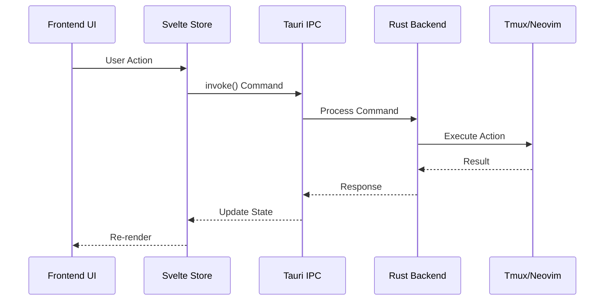

# OrchFlow Development Guide

This guide covers setting up your development environment and understanding the OrchFlow codebase.

## Table of Contents

1. [Environment Setup](#environment-setup)
2. [Architecture Overview](#architecture-overview)
3. [Frontend Development](#frontend-development)
4. [Backend Development](#backend-development)
5. [Testing Strategy](#testing-strategy)
6. [Performance Guidelines](#performance-guidelines)
7. [Contributing](#contributing)

## Environment Setup

### Required Tools

#### All Platforms
- **Node.js** 18+ (recommend using [nvm](https://github.com/nvm-sh/nvm))
- **Rust** 1.75+ (install via [rustup](https://rustup.rs/))
- **Git** 2.30+

#### macOS
```bash
# Install Homebrew if not already installed
/bin/bash -c "$(curl -fsSL https://raw.githubusercontent.com/Homebrew/install/HEAD/install.sh)"

# Install required tools
brew install node rust tmux neovim imagemagick librsvg

# Install Xcode Command Line Tools
xcode-select --install
```

#### Windows
```powershell
# Install Chocolatey if not already installed
Set-ExecutionPolicy Bypass -Scope Process -Force
iex ((New-Object System.Net.WebClient).DownloadString('https://chocolatey.org/install.ps1'))

# Install required tools
choco install nodejs rust git visualstudio2022-workload-vctools

# Install tmux via WSL or Git Bash
# Install Neovim from https://neovim.io/
```

#### Linux (Ubuntu/Debian)
```bash
# Update package list
sudo apt update

# Install build essentials
sudo apt install -y build-essential curl wget file libssl-dev

# Install Node.js via NodeSource
curl -fsSL https://deb.nodesource.com/setup_18.x | sudo -E bash -
sudo apt install -y nodejs

# Install Rust
curl --proto '=https' --tlsv1.2 -sSf https://sh.rustup.rs | sh

# Install Tauri dependencies
sudo apt install -y \
  libwebkit2gtk-4.0-dev \
  libgtk-3-dev \
  libayatana-appindicator3-dev \
  librsvg2-dev \
  patchelf

# Install development tools
sudo apt install -y tmux neovim imagemagick
```

### First-Time Setup

```bash
# Clone the repository
git clone https://github.com/orchflow/orchflow.git
cd orchflow/frontend

# Install dependencies
npm install

# Generate app icons
npm run icons:generate

# Generate updater keys (keep these secure!)
npm run updater:keygen

# Set up pre-commit hooks (optional)
npm run setup:hooks

# Verify setup
npm run check
npm run tauri info
```

## Architecture Overview

### Technology Stack

```
┌─────────────────────────────────────────────────────┐
│                   Frontend (Web)                     │
│  SvelteKit + TypeScript + Tailwind CSS              │
├─────────────────────────────────────────────────────┤
│                   Tauri Bridge                       │
│  IPC Commands + Events + File System                │
├─────────────────────────────────────────────────────┤
│                Backend (Native)                      │
│  Rust + Tokio + SQLite + Sysinfo                   │
├─────────────────────────────────────────────────────┤
│              External Processes                      │
│  tmux + Neovim + Git + Language Servers            │
└─────────────────────────────────────────────────────┘
```

### Key Components

#### Frontend (`src/`)
- **components/** - Reusable UI components
- **services/** - Business logic and API calls
- **stores/** - Svelte stores for state management
- **routes/** - SvelteKit pages and layouts

#### Backend (`src-tauri/src/`)
- **main.rs** - Application entry point
- **orchestrator.rs** - Core coordination logic
- **tmux.rs** - Terminal multiplexer integration
- **neovim.rs** - Editor RPC client
- **state_store.rs** - SQLite persistence
- **metrics.rs** - System monitoring
- **updater.rs** - Auto-update logic

### Data Flow



## Frontend Development

### Component Guidelines

```typescript
// Example component structure
<script lang="ts">
  import { onMount, onDestroy } from 'svelte';
  import { invoke } from '@tauri-apps/api/tauri';
  import type { ComponentProps } from './types';

  export let prop: string;
  
  let state = $state({
    loading: false,
    data: null as Data | null
  });

  onMount(async () => {
    state.loading = true;
    try {
      state.data = await invoke('command_name', { arg: prop });
    } catch (error) {
      console.error('Failed to load:', error);
    } finally {
      state.loading = false;
    }
  });
</script>

<div class="component">
  {#if state.loading}
    <LoadingSpinner />
  {:else if state.data}
    <Content {data} />
  {/if}
</div>

<style>
  .component {
    /* Use CSS variables for theming */
    background: var(--color-surface);
    color: var(--color-text);
  }
</style>
```

### State Management

```typescript
// stores/example.ts
import { writable, derived } from 'svelte/store';
import { invoke } from '@tauri-apps/api/tauri';

interface StoreState {
  items: Item[];
  loading: boolean;
  error: string | null;
}

function createStore() {
  const { subscribe, set, update } = writable<StoreState>({
    items: [],
    loading: false,
    error: null
  });

  return {
    subscribe,
    
    async load() {
      update(s => ({ ...s, loading: true, error: null }));
      try {
        const items = await invoke<Item[]>('get_items');
        update(s => ({ ...s, items, loading: false }));
      } catch (error) {
        update(s => ({ ...s, error: String(error), loading: false }));
      }
    },
    
    async add(item: Item) {
      await invoke('add_item', { item });
      // Optimistic update
      update(s => ({ ...s, items: [...s.items, item] }));
    }
  };
}

export const store = createStore();
```

### Performance Best Practices

1. **Virtual Scrolling**: Use for large lists
   ```svelte
   <VirtualList items={longList} itemHeight={40} />
   ```

2. **Lazy Loading**: Load components on demand
   ```typescript
   const Component = lazy(() => import('./Component.svelte'));
   ```

3. **Debouncing**: Prevent excessive API calls
   ```typescript
   import { debounce } from '$lib/utils';
   const search = debounce((query: string) => {
     invoke('search', { query });
   }, 300);
   ```

## Backend Development

### Tauri Commands

```rust
// Basic command structure
#[tauri::command]
async fn command_name(
    app: AppHandle,
    state: State<'_, AppState>,
    arg1: String,
    arg2: Option<i32>,
) -> Result<Response, String> {
    // Validate inputs
    if arg1.is_empty() {
        return Err("arg1 cannot be empty".to_string());
    }

    // Access state
    let data = state.data.lock().await;
    
    // Perform async operations
    let result = perform_operation(&arg1, arg2).await
        .map_err(|e| e.to_string())?;
    
    // Emit events to frontend
    app.emit_all("event-name", &result).ok();
    
    Ok(result)
}
```

### Error Handling

```rust
use thiserror::Error;

#[derive(Error, Debug)]
enum AppError {
    #[error("Database error: {0}")]
    Database(#[from] sqlx::Error),
    
    #[error("IO error: {0}")]
    Io(#[from] std::io::Error),
    
    #[error("Invalid input: {0}")]
    InvalidInput(String),
}

// Convert to frontend-friendly errors
impl From<AppError> for String {
    fn from(err: AppError) -> String {
        err.to_string()
    }
}
```

### Database Operations

```rust
// Using SQLx for async database operations
async fn save_session(db: &SqlitePool, session: &Session) -> Result<(), sqlx::Error> {
    sqlx::query!(
        r#"
        INSERT INTO sessions (id, name, created_at, data)
        VALUES (?1, ?2, ?3, ?4)
        ON CONFLICT(id) DO UPDATE SET
            name = excluded.name,
            data = excluded.data,
            updated_at = CURRENT_TIMESTAMP
        "#,
        session.id,
        session.name,
        session.created_at,
        session.data
    )
    .execute(db)
    .await?;
    
    Ok(())
}
```

## Testing Strategy

### Unit Tests (Frontend)

```typescript
// Component.test.ts
import { render, fireEvent } from '@testing-library/svelte';
import { expect, test, vi } from 'vitest';
import Component from './Component.svelte';

test('renders and handles click', async () => {
  const onClick = vi.fn();
  const { getByText } = render(Component, {
    props: { onClick }
  });
  
  const button = getByText('Click me');
  await fireEvent.click(button);
  
  expect(onClick).toHaveBeenCalledOnce();
});
```

### Integration Tests (E2E)

```typescript
// cypress/e2e/feature.cy.ts
describe('Feature', () => {
  beforeEach(() => {
    cy.visit('/');
    cy.waitForOrchFlow();
  });

  it('completes user workflow', () => {
    cy.createTerminal();
    cy.get('.terminal').should('be.visible');
    
    cy.openCommandPalette();
    cy.searchCommand('new file');
    cy.executeCommand();
    
    cy.get('.editor').should('be.visible');
  });
});
```

### Performance Tests

```typescript
// Performance monitoring
cy.measurePerformance('action-name');
cy.performAction();
cy.endPerformanceMeasure('action-name', 100); // 100ms threshold
```

## Performance Guidelines

### Target Metrics

- **Startup Time**: < 2 seconds
- **Command Response**: < 100ms
- **File Operations**: < 50ms
- **UI Updates**: 60 FPS
- **Memory Usage**: < 200MB base

### Optimization Techniques

1. **Rust Side**
   ```rust
   // Use Arc for shared immutable data
   let shared_data = Arc::new(expensive_computation());
   
   // Parallel processing with Rayon
   use rayon::prelude::*;
   items.par_iter()
       .map(|item| process(item))
       .collect()
   ```

2. **Frontend Side**
   ```typescript
   // Memoize expensive computations
   const memoized = useMemo(() => {
     return expensiveComputation(data);
   }, [data]);
   
   // Use runes for fine-grained reactivity
   let count = $state(0);
   let doubled = $derived(count * 2);
   ```

3. **IPC Optimization**
   ```rust
   // Batch operations
   #[tauri::command]
   async fn batch_operation(items: Vec<Item>) -> Result<Vec<Result<(), String>>, String> {
     let results = items.into_iter()
         .map(|item| process_item(item))
         .collect();
     Ok(results)
   }
   ```

## Contributing

### Code Style

- **TypeScript**: Use TypeScript strict mode
- **Rust**: Follow standard Rust conventions
- **CSS**: Use CSS variables for theming
- **Components**: Keep them focused and testable

### Pull Request Process

1. **Branch Naming**
   - `feature/description` - New features
   - `fix/issue-number` - Bug fixes
   - `docs/description` - Documentation
   - `perf/description` - Performance improvements

2. **Commit Messages**
   ```
   type(scope): subject
   
   body (optional)
   
   footer (optional)
   ```
   
   Types: feat, fix, docs, style, refactor, perf, test, chore

3. **PR Requirements**
   - [ ] Tests pass (`npm test`)
   - [ ] Type check passes (`npm run check`)
   - [ ] Performance benchmarks met
   - [ ] Documentation updated
   - [ ] Changelog entry added

### Development Workflow

```bash
# Start development
npm run tauri:dev

# Run tests in watch mode
npm run test:unit:watch

# Check types continuously
npm run check:watch

# Test specific platform
npm run tauri:build -- --target x86_64-apple-darwin
```

### Debugging

```bash
# Enable Rust debug logging
RUST_LOG=debug npm run tauri:dev

# Chrome DevTools for frontend
# Right-click in app and select "Inspect Element"

# Rust debugging with VS Code
# Use launch.json configuration
```

## Resources

### Documentation
- [Tauri Docs](https://tauri.app/v1/guides/)
- [SvelteKit Docs](https://kit.svelte.dev/docs)
- [Rust Book](https://doc.rust-lang.org/book/)

### Tools
- [Tauri Plugin Registry](https://tauri.app/v1/guides/plugins/)
- [crates.io](https://crates.io/) - Rust packages
- [npm](https://www.npmjs.com/) - JavaScript packages

### Community
- [Discord](https://discord.gg/orchflow)
- [GitHub Discussions](https://github.com/orchflow/orchflow/discussions)
- [Stack Overflow](https://stackoverflow.com/questions/tagged/orchflow)